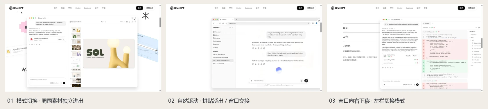

<div align="center">

# DESIGN ATLAS

### 可交互 · 可查询 · 可回看的个人网页设计参考库

从真实网站学习设计，让配色、排版、图像、形状和动效共同工作。

**29 个案例**　·　**21 个真实品牌／文化页面**　·　**8 种经典设计语言**

[打开参考库](https://mibxr-design-atlas.mibxranime.chatgpt.site) · [浏览完整索引](research/CASE-INDEX.md) · [设计元素实验室](https://mibxr-design-atlas.mibxranime.chatgpt.site/fundamentals.html) · [验证记录](QA.md)


<sub>上述配图全部来自本地代码 Demo 的真实浏览器截图。GitHub 仓库为私有；Sites 沿用已有访问范围，当前为公开模式。素材用于个人设计研究。</sub>

</div>

## 在这里能做什么

这是一份能亲手体验的设计参考。每个条目包含实际参考与观察日期、设计元素的协作方式、约束、可复制 Prompt、独立代码 Demo、原站／本地对照及素材来源。

- **查找**：按产品、游戏/IP、艺术文化、经典语言与国家／地区筛选；搜索品牌、配色、布局、交互或约束。
- **体验**：在详情内滚动、悬停、切换和播放，或独立打开完整 Demo；手机面板限制为390px。
- **比较**：选择2–3项并排比较，观察同样的设计元素如何产生不同表达。
- **试验**：配色、字体、布局、留白、形状、图形、层级、质感与动效都能在元素实验室中直接改变画面。
- **复用**：复制案例 Prompt，将品牌、内容和资产换为自己的输入；约束与负向 Prompt 一起使用。
- **桌面与手机**：真实1440px桌面预览保留完整断点；ChatGPT默认展示桌面动效，手机模式可切换。
- **收藏**：保存个人策展结果，并导出／导入 JSON 备份。


## 本轮重点：把交互作为设计的一部分

### ChatGPT · 一个窗口贯穿四段流程

[进入交互案例](https://mibxr-design-atlas.mibxranime.chatgpt.site/#style/chatgpt-platform) · [调研与原站截图](research/chatgpt-platform.md) · [Prompt](prompts/chatgpt-platform.md) · [交互源码](demos/chatgpt-platform/script.js)



指针经过“聊天／工作／编程”即切换；三组真实周边素材独立进出。滚动带入中央界面与分层视差，拼贴先淡出，同一个窗口随后向右下交接，露出左侧说明，并随继续滚动切换模式。点击、键盘和触屏也能使用。原站几何与CSS属性有记录，未取得的完整JS时序明确标为本地近似。

### Google Material · 表现力与组件秩序

[进入新案例](https://mibxr-design-atlas.mibxranime.chatgpt.site/#style/google-material) · [研究](research/google-material.md) · [Prompt](prompts/google-material.md) · [源码](demos/google-material)


依据当前官方首页：固定图标侧栏、大圆角相邻首屏、真实9秒组件视频、Google Sans与角色配色，以及1／2／3项资源分组。CTA、卡片、主题与暂停控制保留不同状态反馈。规范中的物理动效体系与首页实际CSS曲线分别记录。

## 案例画廊

图片进入对应在线案例，文字链接可直接阅读 Prompt、研究与代码。品牌页面是注明范围的局部学习还原，经典语言是有真实参考与理论依据的构成练习。

### 产品与平台 · 8

从产品卖点到可观察的工作结果，版式与交互各自承担说明任务。

<table>
<tr>
<td width="33%" valign="top"><a href="https://mibxr-design-atlas.mibxranime.chatgpt.site/#style/apple-product"></a><br><strong>Apple · 滚动产品舞台</strong><br><sub>镜头系统真实视频随滚动逐帧推进；胶囊图库与进度。</sub><br><br><a href="prompts/apple-product.md">Prompt</a> · <a href="research/apple-product.md">研究</a> · <a href="demos/apple-product">代码</a></td>
<td width="33%" valign="top"><a href="https://mibxr-design-atlas.mibxranime.chatgpt.site/#style/stripe-platform"></a><br><strong>Stripe — 彩带与金融产品矩阵</strong><br><sub>原站SingleWave WebGL缎带、金融矩阵与付款场景轮换。</sub><br><br><a href="prompts/stripe-platform.md">Prompt</a> · <a href="research/stripe-platform.md">研究</a> · <a href="demos/stripe-platform">代码</a></td>
<td width="33%" valign="top"><a href="https://mibxr-design-atlas.mibxranime.chatgpt.site/#style/linear-workflow"></a><br><strong>Linear — 深色产品开发系统</strong><br><sub>深色真实界面与任务板／Insights／项目总览切换。</sub><br><br><a href="prompts/linear-workflow.md">Prompt</a> · <a href="research/linear-workflow.md">研究</a> · <a href="demos/linear-workflow">代码</a></td>
</tr>
<tr>
<td width="33%" valign="top"><a href="https://mibxr-design-atlas.mibxranime.chatgpt.site/#style/notion-editorial"></a><br><strong>Notion — 插画与真实工作空间</strong><br><sub>动词轮换、手绘人物与不同尺度的功能拼图。</sub><br><br><a href="prompts/notion-editorial.md">Prompt</a> · <a href="research/notion-editorial.md">研究</a> · <a href="demos/notion-editorial">代码</a></td>
<td width="33%" valign="top"><a href="https://mibxr-design-atlas.mibxranime.chatgpt.site/#style/chatgpt-platform"></a><br><strong>ChatGPT — 巨字、飞入拼贴与滚动交接</strong><br><sub>悬停模式、独立素材飞入飞出、同一窗口滚动交接。</sub><br><br><a href="prompts/chatgpt-platform.md">Prompt</a> · <a href="research/chatgpt-platform.md">研究</a> · <a href="demos/chatgpt-platform">代码</a></td>
<td width="33%" valign="top"><a href="https://mibxr-design-atlas.mibxranime.chatgpt.site/#style/claude-platform"></a><br><strong>Claude — 衬线语气与 Cowork 演示</strong><br><sub>暖纸色、衬线巨字与真实媒体的克制叙事。</sub><br><br><a href="prompts/claude-platform.md">Prompt</a> · <a href="research/claude-platform.md">研究</a> · <a href="demos/claude-platform">代码</a></td>
</tr>
<tr>
<td width="33%" valign="top"><a href="https://mibxr-design-atlas.mibxranime.chatgpt.site/#style/qoder-platform"></a><br><strong>Qoder — 绿色工作台与多形态平台</strong><br><sub>无衬线巨字、产品内嵌预览、400ms横向平台切换。</sub><br><br><a href="prompts/qoder-platform.md">Prompt</a> · <a href="research/qoder-platform.md">研究</a> · <a href="demos/qoder-platform">代码</a></td>
<td width="33%" valign="top"><a href="https://mibxr-design-atlas.mibxranime.chatgpt.site/#style/google-material"></a><br><strong>Google Material：表现力与组件秩序</strong><br><sub>固定图标轨、角色配色、9秒组件视频与圆角反馈。</sub><br><br><a href="prompts/google-material.md">Prompt</a> · <a href="research/google-material.md">研究</a> · <a href="demos/google-material">代码</a></td>
<td></td>
</tr>
</table>

### 游戏与 IP · 7

角色、世界、音乐与切换节奏共同塑造品牌体验。

<table>
<tr>
<td width="33%" valign="top"><a href="https://mibxr-design-atlas.mibxranime.chatgpt.site/#style/zelda-world"></a><br><strong>塞尔达 · 全景世界舞台</strong><br><sub>同屏世界章节、官方全景视频与用户启用的BGM。</sub><br><br><a href="prompts/zelda-world.md">Prompt</a> · <a href="research/zelda-world.md">研究</a> · <a href="demos/zelda-world">代码</a></td>
<td width="33%" valign="top"><a href="https://mibxr-design-atlas.mibxranime.chatgpt.site/#style/persona-kinetic"></a><br><strong>Persona 5 Royal · 黑金角色拼贴</strong><br><sub>黑金拼贴、斜切图形与500ms角色滑轨。</sub><br><br><a href="prompts/persona-kinetic.md">Prompt</a> · <a href="research/persona-kinetic.md">研究</a> · <a href="demos/persona-kinetic">代码</a></td>
<td width="33%" valign="top"><a href="https://mibxr-design-atlas.mibxranime.chatgpt.site/#style/genshin-world"></a><br><strong>原神 · 版本群像与角色舞台</strong><br><sub>真实世界与角色图层、垂直章节切换。</sub><br><br><a href="prompts/genshin-world.md">Prompt</a> · <a href="research/genshin-world.md">研究</a> · <a href="demos/genshin-world">代码</a></td>
</tr>
<tr>
<td width="33%" valign="top"><a href="https://mibxr-design-atlas.mibxranime.chatgpt.site/#style/arknights-world"></a><br><strong>明日方舟 · 工业档案与干员舞台</strong><br><sub>黑白工业排版、官方角色和分区导航。</sub><br><br><a href="prompts/arknights-world.md">Prompt</a> · <a href="research/arknights-world.md">研究</a> · <a href="demos/arknights-world">代码</a></td>
<td width="33%" valign="top"><a href="https://mibxr-design-atlas.mibxranime.chatgpt.site/#style/uma-musume"></a><br><strong>赛马娘：群像赛道与斜切叙事</strong><br><sub>明亮品牌色、400ms角色移动与有界翻页。</sub><br><br><a href="prompts/uma-musume.md">Prompt</a> · <a href="research/uma-musume.md">研究</a> · <a href="demos/uma-musume">代码</a></td>
<td width="33%" valign="top"><a href="https://mibxr-design-atlas.mibxranime.chatgpt.site/#style/blue-archive"></a><br><strong>碧蓝档案：学园都市的天空与光</strong><br><sub>蓝白校园语气、官方人物与1000ms学院资料滑轨。</sub><br><br><a href="prompts/blue-archive.md">Prompt</a> · <a href="research/blue-archive.md">研究</a> · <a href="demos/blue-archive">代码</a></td>
</tr>
<tr>
<td width="33%" valign="top"><a href="https://mibxr-design-atlas.mibxranime.chatgpt.site/#style/monument-valley-game"></a><br><strong>纪念碑谷：电影画面与安静的品牌秩序</strong><br><sub>真实建筑图像、克制留白与500ms横向截图画廊。</sub><br><br><a href="prompts/monument-valley-game.md">Prompt</a> · <a href="research/monument-valley-game.md">研究</a> · <a href="demos/monument-valley-game">代码</a></td>
<td></td>
<td></td>
</tr>
</table>

### 艺术与文化 · 6

作品、海报、摄影与活动信息决定画面的主次关系。

<table>
<tr>
<td width="33%" valign="top"><a href="https://mibxr-design-atlas.mibxranime.chatgpt.site/#style/design-sight"></a><br><strong>21_21 DESIGN SIGHT：海报与四列档案</strong><br><sub>海报主导、双图1000ms交叉淡化与信息分层。</sub><br><br><a href="prompts/design-sight.md">Prompt</a> · <a href="research/design-sight.md">研究</a> · <a href="demos/design-sight">代码</a></td>
<td width="33%" valign="top"><a href="https://mibxr-design-atlas.mibxranime.chatgpt.site/#style/mori-art-museum"></a><br><strong>森美术馆：红色机构锚点与艺术海报</strong><br><sub>作品优先的展览编辑结构，保留克制浏览节奏。</sub><br><br><a href="prompts/mori-art-museum.md">Prompt</a> · <a href="research/mori-art-museum.md">研究</a> · <a href="demos/mori-art-museum">代码</a></td>
<td width="33%" valign="top"><a href="https://mibxr-design-atlas.mibxranime.chatgpt.site/#style/fuji-rock"></a><br><strong>Fuji Rock：现场照片与节日导览</strong><br><sub>年度海报、800ms淡化轮播与展开式大菜单。</sub><br><br><a href="prompts/fuji-rock.md">Prompt</a> · <a href="research/fuji-rock.md">研究</a> · <a href="demos/fuji-rock">代码</a></td>
</tr>
<tr>
<td width="33%" valign="top"><a href="https://mibxr-design-atlas.mibxranime.chatgpt.site/#style/rijksmuseum-art"></a><br><strong>Rijksmuseum · 全幅摄影与巨大字标</strong><br><sub>巨幅字标、满屏摄影与500ms全屏菜单淡入。</sub><br><br><a href="prompts/rijksmuseum-art.md">Prompt</a> · <a href="research/rijksmuseum-art.md">研究</a> · <a href="demos/rijksmuseum-art">代码</a></td>
<td width="33%" valign="top"><a href="https://mibxr-design-atlas.mibxranime.chatgpt.site/#style/met-museum"></a><br><strong>The Met · 编辑式展览与馆藏陈列</strong><br><sub>30秒官方季节影像、编辑标题及原生展览横架。</sub><br><br><a href="prompts/met-museum.md">Prompt</a> · <a href="research/met-museum.md">研究</a> · <a href="demos/met-museum">代码</a></td>
<td width="33%" valign="top"><a href="https://mibxr-design-atlas.mibxranime.chatgpt.site/#style/philharmonie-music"></a><br><strong>巴黎爱乐厅 · 音乐展与音乐会详情</strong><br><sub>展览海报与顺序摄影；音乐会500ms滑轨和票务侧栏。</sub><br><br><a href="prompts/philharmonie-music.md">Prompt</a> · <a href="research/philharmonie-music.md">研究</a> · <a href="demos/philharmonie-music">代码</a></td>
</tr>
</table>

### 经典设计语言 · 8

理解构成规则和约束，再将其迁移到新的内容。

<table>
<tr>
<td width="33%" valign="top"><a href="https://mibxr-design-atlas.mibxranime.chatgpt.site/#style/hand-drawn"></a><br><strong>手绘：把不完美变成亲近感</strong><br><sub>不完全直线、纸面质感和亲近的图文关系。</sub><br><br><a href="prompts/hand-drawn.md">Prompt</a> · <a href="research/hand-drawn.md">研究</a> · <a href="demos/hand-drawn">代码</a></td>
<td width="33%" valign="top"><a href="https://mibxr-design-atlas.mibxranime.chatgpt.site/#style/isometric-3d"></a><br><strong>等轴 3D：让空间讲述系统</strong><br><sub>统一投影、空间层次和部件的结构关联。</sub><br><br><a href="prompts/isometric-3d.md">Prompt</a> · <a href="research/isometric-3d.md">研究</a> · <a href="demos/isometric-3d">代码</a></td>
<td width="33%" valign="top"><a href="https://mibxr-design-atlas.mibxranime.chatgpt.site/#style/line-art"></a><br><strong>线条：沿绘制顺序解释结构</strong><br><sub>单一线宽、描边绘制顺序和轻量留白。</sub><br><br><a href="prompts/line-art.md">Prompt</a> · <a href="research/line-art.md">研究</a> · <a href="demos/line-art">代码</a></td>
</tr>
<tr>
<td width="33%" valign="top"><a href="https://mibxr-design-atlas.mibxranime.chatgpt.site/#style/shape-morph"></a><br><strong>动态形状：同一单元，多种表达</strong><br><sub>拓扑可兼容的形状变化与连续状态反馈。</sub><br><br><a href="prompts/shape-morph.md">Prompt</a> · <a href="research/shape-morph.md">研究</a> · <a href="demos/shape-morph">代码</a></td>
<td width="33%" valign="top"><a href="https://mibxr-design-atlas.mibxranime.chatgpt.site/#style/swiss-grid"></a><br><strong>瑞士设计：编辑网格</strong><br><sub>强网格、无衬线尺度和清晰编辑层级。</sub><br><br><a href="prompts/swiss-grid.md">Prompt</a> · <a href="research/swiss-grid.md">研究</a> · <a href="demos/swiss-grid">代码</a></td>
<td width="33%" valign="top"><a href="https://mibxr-design-atlas.mibxranime.chatgpt.site/#style/bauhaus-geometry"></a><br><strong>包豪斯：几何与实验</strong><br><sub>基本几何、有限色盘和均衡的非对称构成。</sub><br><br><a href="prompts/bauhaus-geometry.md">Prompt</a> · <a href="research/bauhaus-geometry.md">研究</a> · <a href="demos/bauhaus-geometry">代码</a></td>
</tr>
<tr>
<td width="33%" valign="top"><a href="https://mibxr-design-atlas.mibxranime.chatgpt.site/#style/retro-80s"></a><br><strong>80年代：合成器面板</strong><br><sub>霓虹、网格和受控的复古质感。</sub><br><br><a href="prompts/retro-80s.md">Prompt</a> · <a href="research/retro-80s.md">研究</a> · <a href="demos/retro-80s">代码</a></td>
<td width="33%" valign="top"><a href="https://mibxr-design-atlas.mibxranime.chatgpt.site/#style/pixel-world"></a><br><strong>像素：微型世界</strong><br><sub>像素网格、整数尺度与逐帧角色反馈。</sub><br><br><a href="prompts/pixel-world.md">Prompt</a> · <a href="research/pixel-world.md">研究</a> · <a href="demos/pixel-world">代码</a></td>
<td></td>
</tr>
</table>

## 设计元素怎样统一表达

| 元素 | 在画面中的作用 | 实验室中的操作 |
|---|---|---|
| 配色 | 区分背景、表面、正文、强调和反馈 | 带入案例色板、改色、比较纯色文字对比度 |
| 字体与排版 | 形成语气、阅读节奏和尺度层级 | 切换字型、布局、层级与留白 |
| 图像与图形 | 展示产品、人物、世界或作品 | 改变图形类型、比例及质感 |
| 形状与构成 | 把按钮、容器、装饰组织成一致语言 | 改变圆角／几何形状和组合 |
| 动效与反馈 | 解释状态变化、引导注意、保持空间连续 | 切换动效、触发反馈，并比较静态状态 |
| 协调关系 | 让所有元素围绕同一主题和重点 | 单项混搭、加载案例方案、复制配置与 Prompt |

[设计基础研究](research/foundations.md)记录理论来源。文字对比度检查仅覆盖所选纯色组合，不能替代整页可访问性验证。地区用于具体机构与创作来源，不把一个案例概括成整个国家的固定风格。

## 复用与体验

### 本地运行

需要 **Node.js**，项目运行不需要安装第三方依赖。Windows可双击 `start.cmd`，或执行：

```bash
npm start
```

打开 [http://127.0.0.1:4173](http://127.0.0.1:4173)。`Ctrl+C` 结束服务。服务只绑定本机，建议保持固定地址；改变主机名或端口会得到独立收藏。

### 从参考到自己的设计

1. 在对应 Demo 中实际操作，读清楚原站观察与本地差异。
2. 复制 `prompts/<id>.md`，填写目标产品、内容、素材、尺寸与观察日期。
3. 保留该风格的网格、层级、比例和状态关系，再调整自己的品牌输入。
4. 对照制作约束，测试滚动、键盘、手机、音视频及减少动态效果。
5. 保存对比截图、改动理由与Git提交，让个人判断也能回看。

音频由用户启用；静音视频可播放并提供暂停。真实品牌素材按原比例本地保存。登录、购买、预约和实际服务入口指向官网，不在本库执行。

### 收藏与迁移

收藏保存在当前站点浏览器的 `localStorage`，键为 `atlas-favorites`，内容只有案例ID。它不上传、不同步账号，也不会自动写入Git。

刷新保留；换浏览器、地址、端口或清理网站数据后，收藏不同。“收藏备份与说明”可导出JSON并粘贴导入，导入合并有效ID、去重并忽略未知条目。将导出的JSON自行纳入Git即可保存个人策展结果。

## 资料结构与维护

```text
entries/<id>.json              案例、设计元素、约束、来源、Prompt的单一数据源
prompts/<id>.md                由 entries 生成的可读 Prompt
research/<id>.md               观察、理论、分析推断、复现映射
research/screenshots/          原站实际关键帧与状态证据
demos/<id>/                   HTML、CSS、JS与本地图片／字体／音视频
  fidelity.md                 已复现、近似、未实现与观察限制
  assets-manifest.json        公开来源、用途、处理方式、字节数、SHA256
previews/                     本地实际截图与交互状态
docs/readme/                  本README配图
fundamentals.*                可操作的设计元素实验室
catalog.js                    自动生成的浏览器目录
scripts/                      本机服务、目录生成、静态构建与资产检查
.openai/hosting.json           现有Sites项目与静态目录配置
```

`npm run build` 从 entries 更新目录、完整索引及 Prompt；`npm run check` 检查字段、来源、本地引用、JS语法、预览和资产大小／哈希。`npm run build:site` 生成部署目录 `dist/`，不含Git元数据和本地服务。新增或修改案例遵循 [贡献流程](CONTRIBUTING.md)。

```bash
npm run build
npm run check
npm run build:site
```

### 如何判断还原范围

调研记录区分**直接观察、理论解释、本库分析**；每个品牌案例的 `fidelity.md` 标注**已还原、近似、未实现**。动画关键帧与运行时DOM有证据，但不能把局部实现称为完整源站克隆。原站内容会更新，所有对照以观察日期为准。

本轮验证及未解决限制见 [QA.md](QA.md)；逐项动效审计见 [Motion Audit](research/MOTION-AUDIT.md)。GitHub用于保留源码与调研，Sites使用同一已推送提交生成部署版本；推送GitHub本身不代表Sites已经更新。

## 版权与研究边界

本库用于个人设计学习。品牌名称、字标、摄影、角色、音乐、视频及字体的权利仍归原作者；保留素材清单与来源，不把官方媒体自动视为开源或可商用。仓库未给这些第三方资产授予再分发许可。扩展公开传播或商业使用前，应替换为自己的资产或取得相应授权。

README的组织参考 [mg-styles-15](https://github.com/MIBXR/mg-styles-15) 的封面、画廊与复用入口方式；配图和说明来自本库当前实现。
