<div align="center">

# DESIGN ATLAS

### 可交互 · 可查询 · 可回看的个人网页设计案例库

从真实网站学习设计，让配色、排版、图像、形状和动效共同工作。

<!-- atlas-counts:start -->
**34 个案例**　·　**26 个品牌／文化研究**　·　**8 种经典设计语言**
<!-- atlas-counts:end -->

[打开首页](https://mibxr-design-atlas.mibxranime.chatgpt.site) · [浏览案例](https://mibxr-design-atlas.mibxranime.chatgpt.site/cases.html) · [设计巧思](https://mibxr-design-atlas.mibxranime.chatgpt.site/patterns.html) · [设计实验室](https://mibxr-design-atlas.mibxranime.chatgpt.site/fundamentals.html) · [Agent 工作流](https://mibxr-design-atlas.mibxranime.chatgpt.site/agent.html) · [完整索引](research/CASE-INDEX.md)

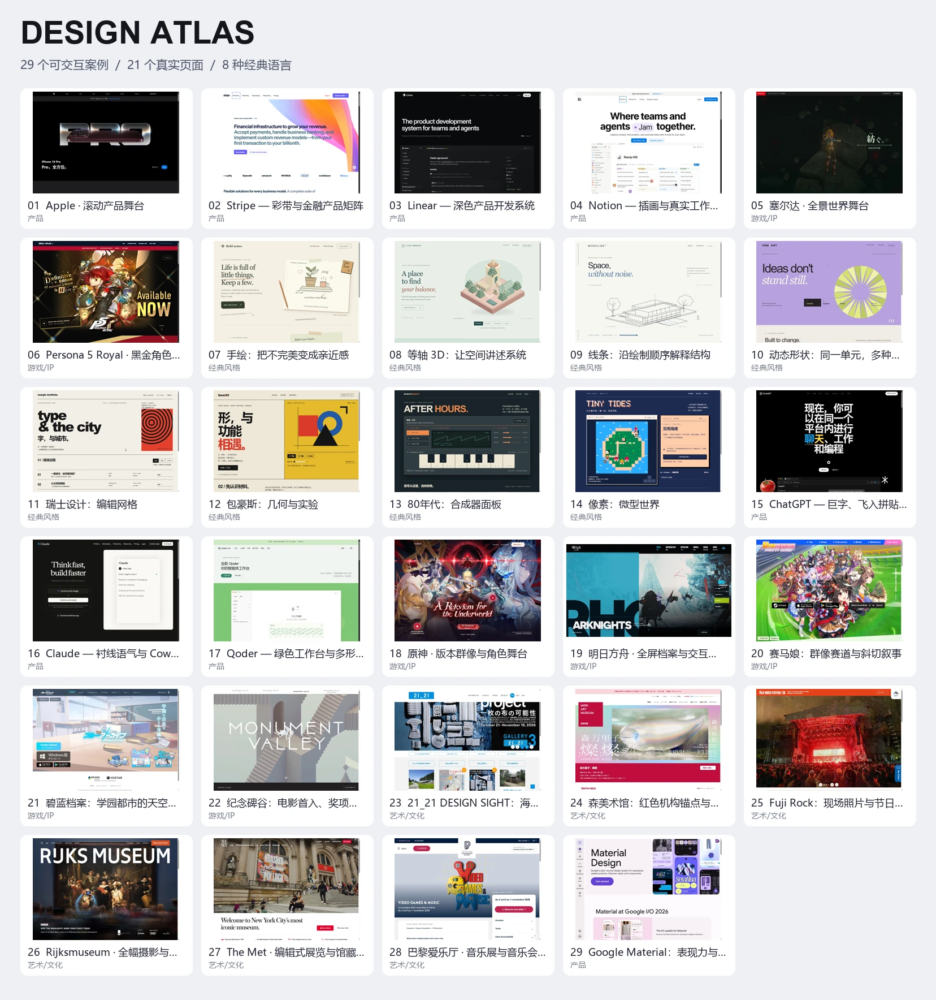

<sub>配图来自可运行 Demo 的实际浏览器截图。</sub>

</div>

## 在这里能做什么

这是一份能亲手体验的设计参考。每个条目包含实际参考与观察日期、设计元素的协作方式、约束、可复制 Prompt、独立代码 Demo、原站／本地对照及素材来源。

首页介绍完整案例、独立巧思、设计实验室与 Agent 工作流，主导航可直接切换。案例浏览位于 `cases.html`；已有根路径的案例深链接、比较入口与分类／地区／搜索／排序 URL 会保留状态并进入案例库。

真实网站案例固定为所标注网址与采集日期的单一归档；完成后保留当时的页面与交互，不追随官网后续变化。

- **查找**：按产品、游戏/IP、艺术文化、经典语言与国家／地区筛选；搜索品牌、配色、布局、交互或约束。分类、地区、搜索与排序保留在 URL 中，支持刷新恢复、浏览器前进／后退和分享筛选结果（例如 `cases.html?category=games`）。
- **体验**：在详情内滚动、悬停、切换和播放，或独立打开完整 Demo；手机面板限制为390px。
- **比较**：选择2–3项并排比较，七节说明按同名章节逐行对齐；每行采用最长内容所需的自然高度，便于比较不同案例在同一设计维度上的区别。
- **设计巧思**：独立巧思页按视觉、微动效、页面动效、声音、内容与组织筛选，再按功能用途、来源案例与关键词找可单独借用的机制；首页和实验室可实际操作本地示意，巧思详情按需载入完整来源 Demo；每项有触发、结果、适用场景、边界、组合建议、Prompt和完整案例回跳。同一机制可以来自多个案例，也可以与其他案例的机制组合。
- **试验**：配色、字体、布局、留白、形状、图形、层级、质感与动效都能在设计实验室中直接改变画面；深浅主题按背景、表面、文字与强调角色一起变化，JSON和Prompt导出保留实际选择。
- **复用**：复制案例 Prompt，将品牌、内容和资产换为自己的输入；约束与负向 Prompt 一起使用。
- **Agent 选型**：调用 [design-atlas skill](https://github.com/MIBXR/mibxr-skills/tree/main/skills/design-atlas)，先了解最新目录，再围绕需求迭代筛选，自动取得完整说明、文档和源码。也可从 [Agent 入口](https://mibxr-design-atlas.mibxranime.chatgpt.site/agent.html) 直接取指定案例。
- **桌面与手机**：真实1440px桌面预览保留完整断点；ChatGPT默认展示桌面动效，手机模式可切换。
- **主题与声音**：案例库支持跟随系统／浅色／深色；每个案例说明原站的主题方式、音乐或媒体声音及其交互作用，固定品牌主题保留原貌。
- **收藏**：浏览器localStorage保存个人策展结果，并导出／导入 JSON 备份；不同设备或域名不会自动同步。
- **加载与复用**：案例先准备首屏关键图像、字体与视频第一帧，再开始开场；未就绪时显示进度与重试。固定版本的大素材在同一站点内缓存，嵌入预览与独立打开共享已经下载的内容。

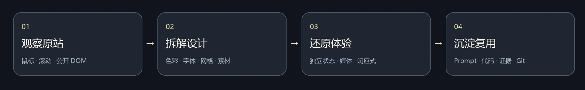

## 网站也从自己的案例中学习

Design Atlas 也在使用自己的案例库。首页借鉴收录的 [ChatGPT 案例](research/chatgpt-platform.md) 的滚动交接，用同一展示窗串起浏览案例、调配元素与参考构建；实验室把案例的配色、排版与构成机制迁移到同一份内容上，让方案可以实际操作与比较。

从案例中找依据，在实际使用中观察，再结合人的反馈改进网站本体。这也是这份案例库从参考走向实践的过程。

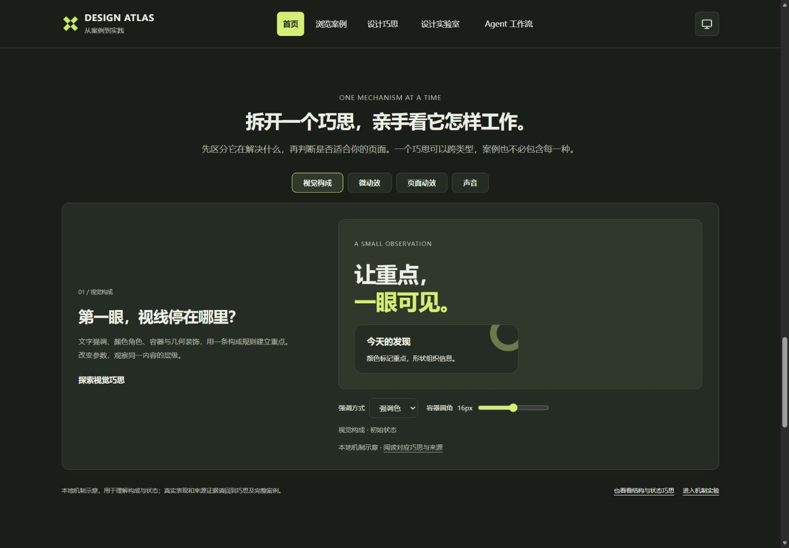

| 首页中的真实实验室 | 浏览案例 |
| --- | --- |
| 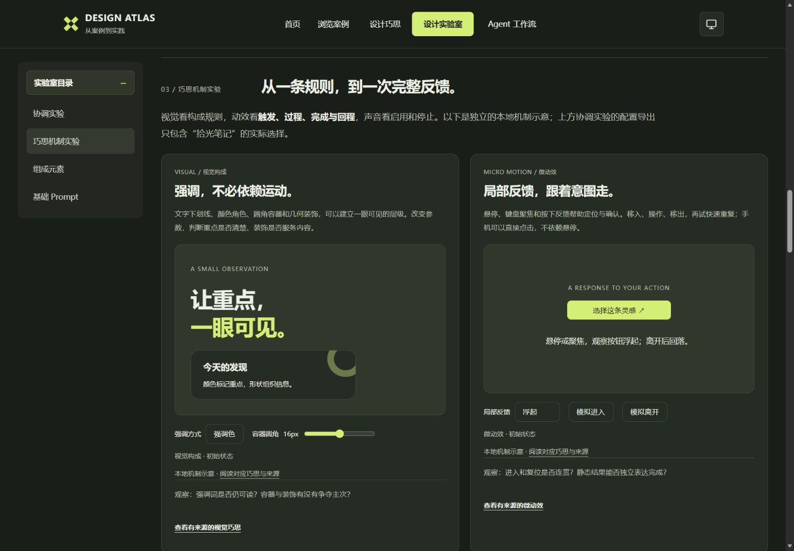 | 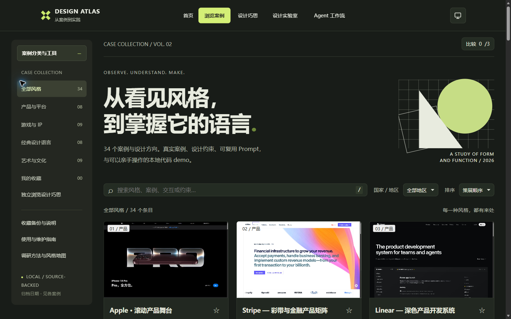 |

以上为网站本体的实际浏览器截图；各案例的独立 Demo 预览见下方画廊。

### 按体验方式理解巧思

| 类型 | 关注点 | 可以操作的示意 |
| --- | --- | --- |
| 视觉巧思 | 颜色、字体、容器与图形形成静态关系 | 标题强调与容器圆角 |
| 微动效 | 局部反馈或辅助信息的运动 | 按钮浮起、形状变化与回程 |
| 页面动效 | 页面或主要内容舞台的交接 | 按方向进入、覆盖、交接与退出的遮罩 |
| 声音巧思 | 音乐、语音与操作音的主动体验 | 主动开启、合成确认短音与静音 |
| 内容与组织 | 阅读、导航和状态规则 | 单开信息与折叠 |

类型可以交叉；功能用途分类继续独立保留。不要求每个案例都有视觉、动效或声音巧思。示意使用通用内容与本地拟合参数，完整来源保留归档观察与复现边界。声音默认关闭，示意切到后台会关闭，回到前台需要重新启用。

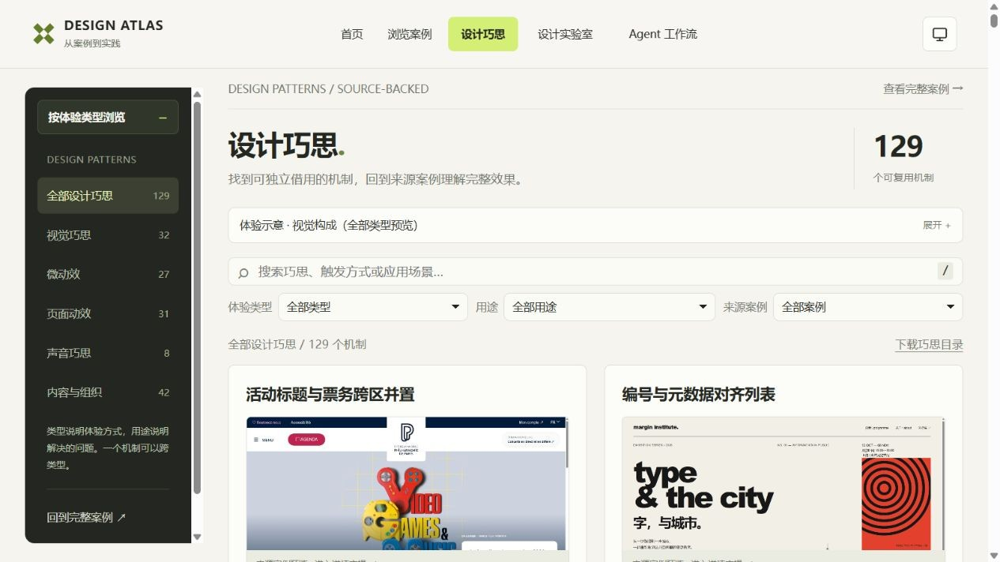

## Agent 直接取材

网页保留人工预览与比较；Agent 可通过 [工作流入口](https://mibxr-design-atlas.mibxranime.chatgpt.site/agent.html)、[结构化索引](agent/catalog.json) 和按案例生成的完整上下文取得设计依据。原始条目、原 Prompt、研究、复现边界与带 SHA256 的文件清单一起读取，源码与媒体按需获取。

组合机制时先读 [设计巧思目录](agent/patterns.json)，再取得 `agent/patterns/<id>.json`。巧思包保留完整机制资料、证据类型、参数来源、组合关系、取材文件及关联案例包位置／哈希；例如 [标题悬停与聚焦选择](patterns/hover-focus-mode-selection.json)、[窗口垂直进出](patterns/vertical-card-swap.json) 和 [指针排斥点阵](patterns/pointer-repulsion-particles.json)。完整案例继续帮助判断多个机制在一个页面中如何协作。普通新增巧思由构建扫描，无需复制内容到skill仓库。

```sh
node scripts/atlas.mjs search "深色 产品" --limit 3
node scripts/atlas.mjs show linear-workflow --source
node scripts/atlas.mjs export linear-workflow --out ../linear-reference
```

命令只需 Node.js，无需安装依赖。完整导出保留运行所需相对路径和原始素材；`--code-only` 会明确列出尚未导出的媒体。数据契约与真实任务适配方法见 [AGENT.md](AGENT.md)。独立 [design-atlas skill](https://github.com/MIBXR/mibxr-skills/tree/main/skills/design-atlas) 保存获取脚本与会话版本指针，新会话发现上游默认分支最新提交后固定版本，持续讨论可显式刷新。完整案例仍在本仓库，新增案例无需更新 Skill；未合并 PR 可用 `--ref <已推送的完整SHA>` 读取，支持无需克隆整个库的远程取材。

## 案例画廊

图片进入对应在线案例，文字链接可直接阅读 Prompt、研究与代码。品牌页面是注明范围的局部学习还原，官方影像条目明确标记网页转译，经典语言是有真实参考与理论依据的构成练习。

### 产品与平台 · 8

从产品卖点到可观察的工作结果，版式与交互各自承担说明任务。

<table>
<tr>
<td width="33%" valign="top"><a href="https://mibxr-design-atlas.mibxranime.chatgpt.site/cases.html#style/apple-product">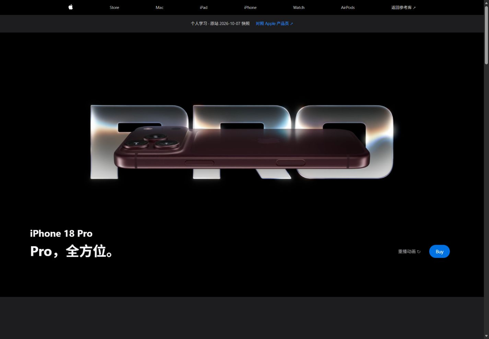</a><br><strong>Apple · 滚动产品舞台</strong><br><sub>镜头系统真实视频随滚动逐帧推进；胶囊图库与进度。</sub><br><br><a href="prompts/apple-product.md">Prompt</a> · <a href="research/apple-product.md">研究</a> · <a href="demos/apple-product">代码</a> · <a href="previews/mobile/apple-product.jpg">手机预览</a></td>
<td width="33%" valign="top"><a href="https://mibxr-design-atlas.mibxranime.chatgpt.site/cases.html#style/stripe-platform">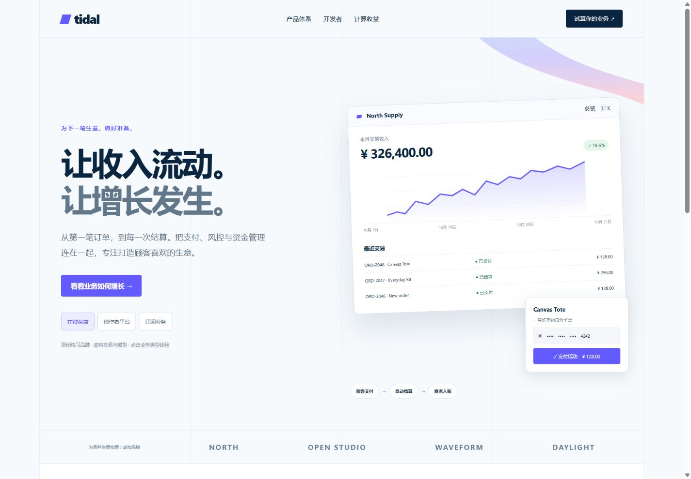</a><br><strong>Stripe — 彩带与金融产品矩阵</strong><br><sub>SingleWave WebGL 波面、客户面板展开与手机二级导航。</sub><br><br><a href="prompts/stripe-platform.md">Prompt</a> · <a href="research/stripe-platform.md">研究</a> · <a href="demos/stripe-platform">代码</a> · <a href="previews/mobile/stripe-platform.jpg">手机预览</a></td>
<td width="33%" valign="top"><a href="https://mibxr-design-atlas.mibxranime.chatgpt.site/cases.html#style/linear-workflow">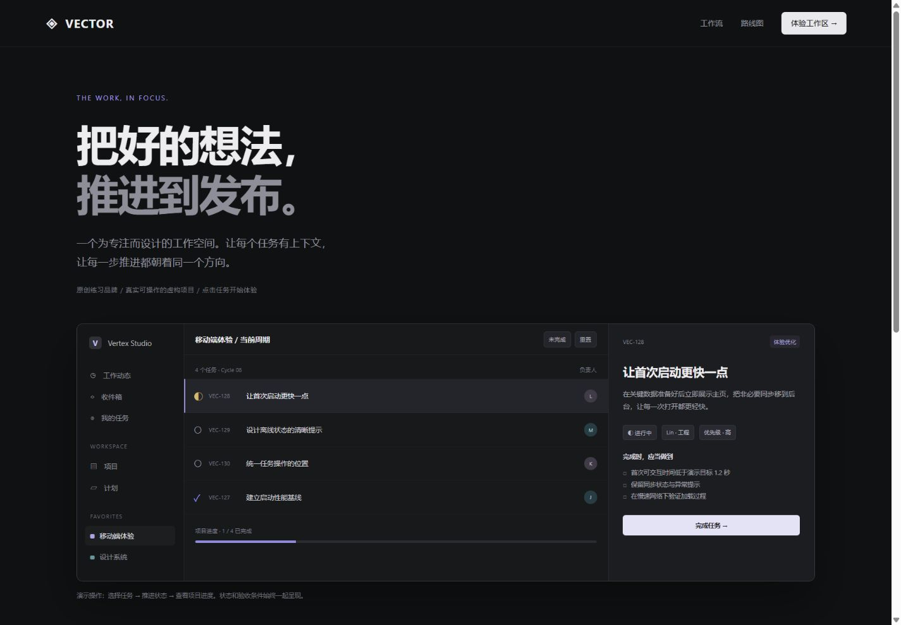</a><br><strong>Linear — 深色产品开发系统</strong><br><sub>消息与任务卡接力、AI处理节拍、Build代码差异演示。</sub><br><br><a href="prompts/linear-workflow.md">Prompt</a> · <a href="research/linear-workflow.md">研究</a> · <a href="demos/linear-workflow">代码</a> · <a href="previews/mobile/linear-workflow.jpg">手机预览</a></td>
</tr>
<tr>
<td width="33%" valign="top"><a href="https://mibxr-design-atlas.mibxranime.chatgpt.site/cases.html#style/notion-editorial">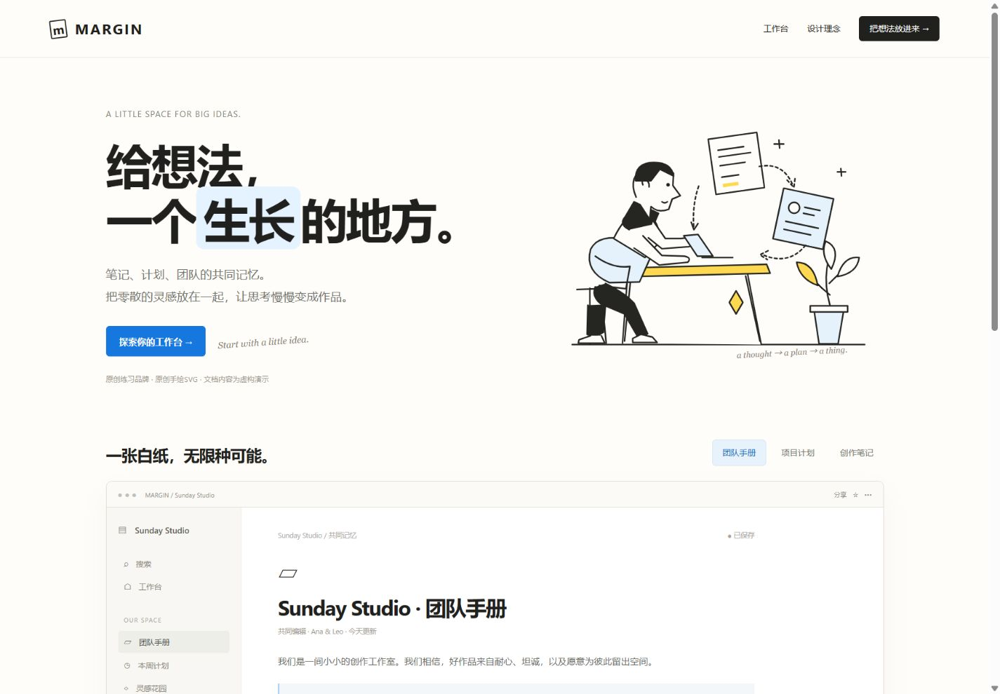</a><br><strong>Notion — 插画与真实工作空间</strong><br><sub>动词与宽度轮换、真实产品视频与手机单开导航。</sub><br><br><a href="prompts/notion-editorial.md">Prompt</a> · <a href="research/notion-editorial.md">研究</a> · <a href="demos/notion-editorial">代码</a> · <a href="previews/mobile/notion-editorial.jpg">手机预览</a></td>
<td width="33%" valign="top"><a href="https://mibxr-design-atlas.mibxranime.chatgpt.site/cases.html#style/chatgpt-platform">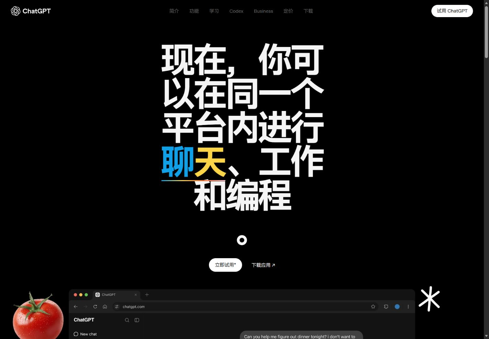</a><br><strong>ChatGPT — 巨字、飞入拼贴与滚动交接</strong><br><sub>悬停模式、独立素材飞入飞出、同一窗口滚动交接。</sub><br><br><a href="prompts/chatgpt-platform.md">Prompt</a> · <a href="research/chatgpt-platform.md">研究</a> · <a href="demos/chatgpt-platform">代码</a> · <a href="previews/mobile/chatgpt-platform.jpg">手机预览</a></td>
<td width="33%" valign="top"><a href="https://mibxr-design-atlas.mibxranime.chatgpt.site/cases.html#style/claude-platform">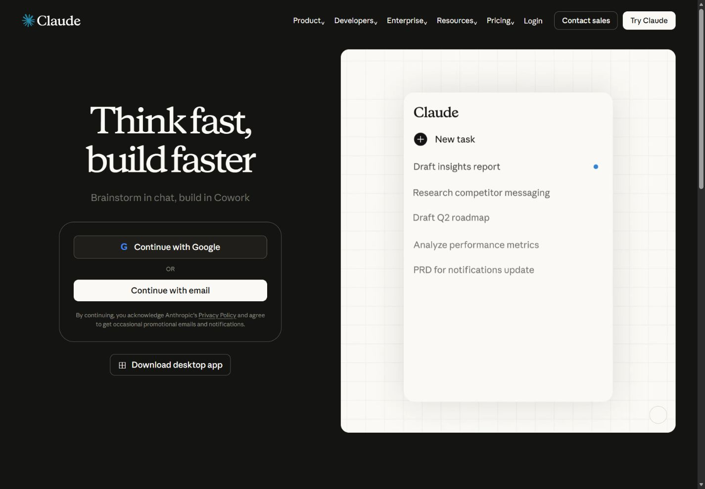</a><br><strong>Claude — 衬线语气与 Cowork 演示</strong><br><sub>暖纸色、衬线巨字与真实媒体的克制叙事。</sub><br><br><a href="prompts/claude-platform.md">Prompt</a> · <a href="research/claude-platform.md">研究</a> · <a href="demos/claude-platform">代码</a> · <a href="previews/mobile/claude-platform.jpg">手机预览</a></td>
</tr>
<tr>
<td width="33%" valign="top"><a href="https://mibxr-design-atlas.mibxranime.chatgpt.site/cases.html#style/qoder-platform">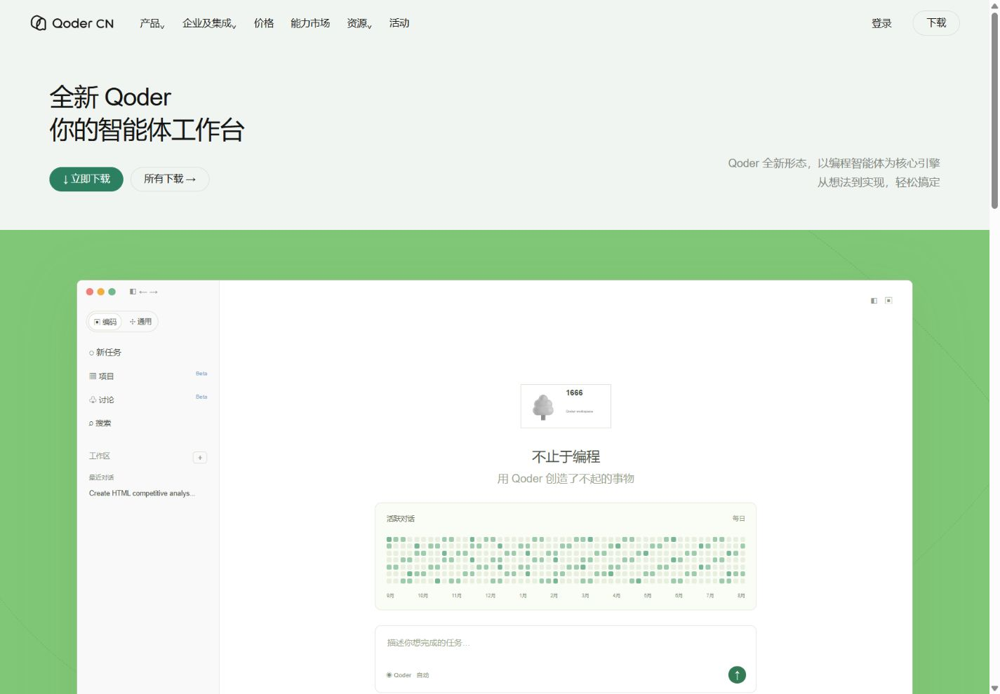</a><br><strong>Qoder — 绿色工作台与多形态平台</strong><br><sub>无衬线巨字、产品内嵌预览、400ms横向平台切换。</sub><br><br><a href="prompts/qoder-platform.md">Prompt</a> · <a href="research/qoder-platform.md">研究</a> · <a href="demos/qoder-platform">代码</a> · <a href="previews/mobile/qoder-platform.jpg">手机预览</a></td>
<td width="33%" valign="top"><a href="https://mibxr-design-atlas.mibxranime.chatgpt.site/cases.html#style/google-material">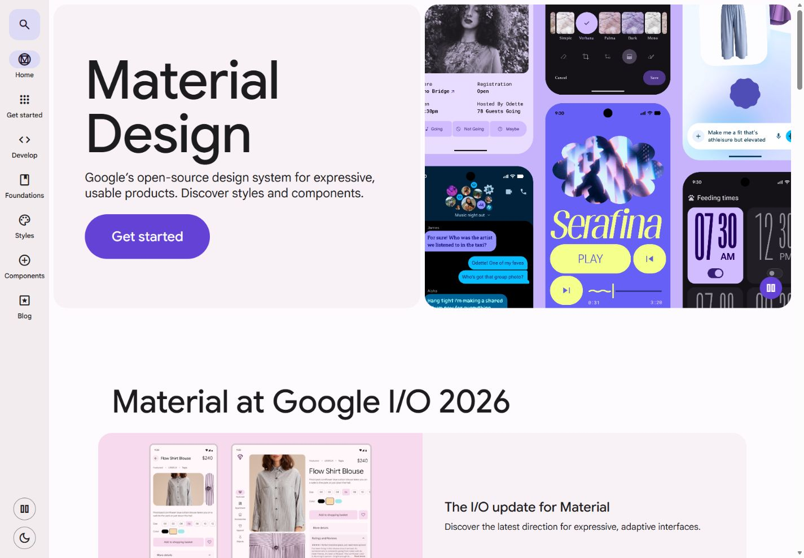</a><br><strong>Google Material：表现力与组件秩序</strong><br><sub>系统与手动主题、300ms目录、9秒组件视频与圆角反馈。</sub><br><br><a href="prompts/google-material.md">Prompt</a> · <a href="research/google-material.md">研究</a> · <a href="demos/google-material">代码</a> · <a href="previews/mobile/google-material.jpg">手机预览</a></td>
<td></td>
</tr>
</table>

### 游戏与 IP · 9

角色、世界、音乐与切换节奏共同塑造品牌体验。

<table>
<tr>
<td width="33%" valign="top"><a href="https://mibxr-design-atlas.mibxranime.chatgpt.site/cases.html#style/zelda-world">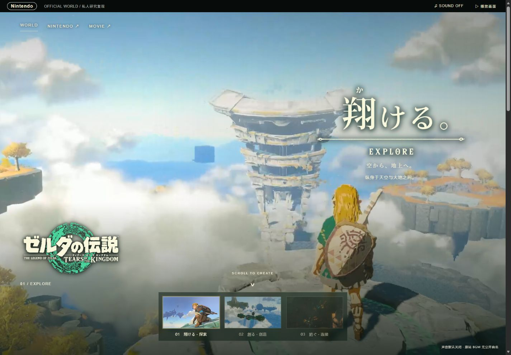</a><br><strong>塞尔达 · 全景世界舞台</strong><br><sub>声音选择开场、古代纹样缩略图框、世界场景淡化与官方BGM。</sub><br><br><a href="prompts/zelda-world.md">Prompt</a> · <a href="research/zelda-world.md">研究</a> · <a href="demos/zelda-world">代码</a> · <a href="previews/mobile/zelda-world.jpg">手机预览</a></td>
<td width="33%" valign="top"><a href="https://mibxr-design-atlas.mibxranime.chatgpt.site/cases.html#style/persona-kinetic">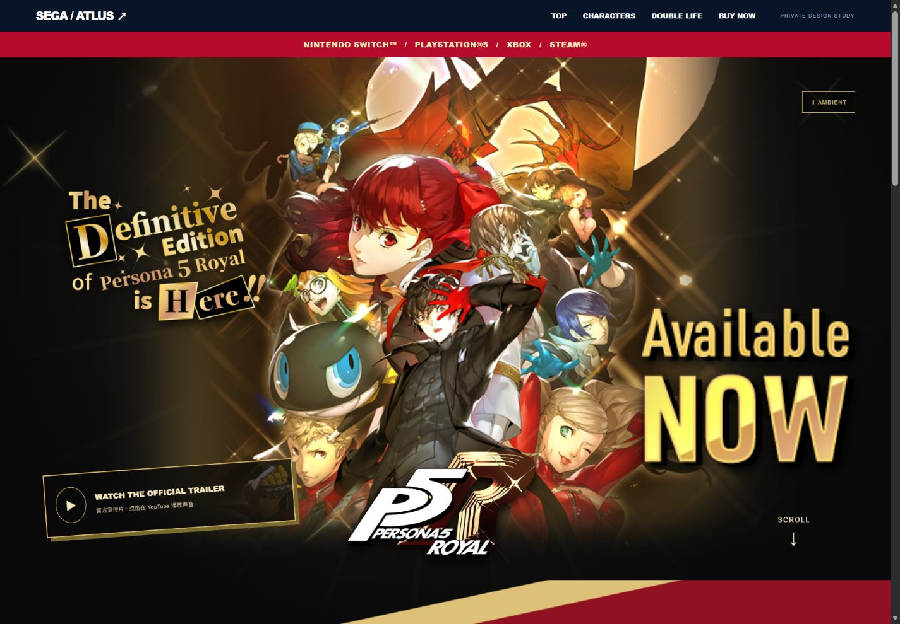</a><br><strong>Persona 5 Royal · 黑金角色拼贴</strong><br><sub>SCREEN 星纹呼吸、滚动视差、角色服装与两套独立滑轨。</sub><br><br><a href="prompts/persona-kinetic.md">Prompt</a> · <a href="research/persona-kinetic.md">研究</a> · <a href="demos/persona-kinetic">代码</a> · <a href="previews/mobile/persona-kinetic.jpg">手机预览</a></td>
<td width="33%" valign="top"><a href="https://mibxr-design-atlas.mibxranime.chatgpt.site/cases.html#style/genshin-world">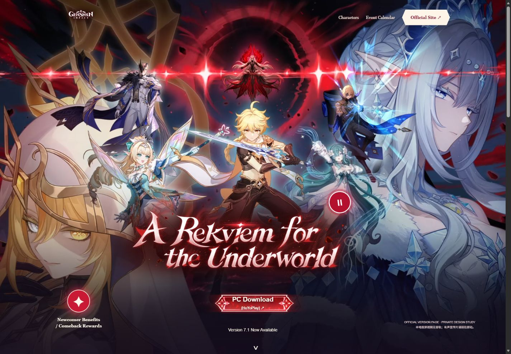</a><br><strong>原神 · 版本群像与角色舞台</strong><br><sub>竖向整屏章切、角色背景联动与六条原始随机语音。</sub><br><br><a href="prompts/genshin-world.md">Prompt</a> · <a href="research/genshin-world.md">研究</a> · <a href="demos/genshin-world">代码</a> · <a href="previews/mobile/genshin-world.jpg">手机预览</a></td>
</tr>
<tr>
<td width="33%" valign="top"><a href="https://mibxr-design-atlas.mibxranime.chatgpt.site/cases.html#style/arknights-world">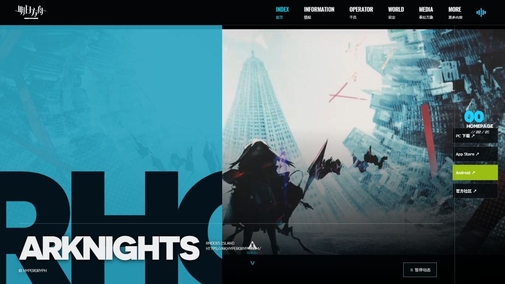</a><br><strong>明日方舟 · 全屏档案与交互点阵</strong><br><sub>全屏载入、侧向遮罩与滚号、原站点阵互动和 BGM。</sub><br><br><a href="prompts/arknights-world.md">Prompt</a> · <a href="research/arknights-world.md">研究</a> · <a href="demos/arknights-world">代码</a> · <a href="previews/mobile/arknights-world.jpg">手机预览</a></td>
<td width="33%" valign="top"><a href="https://mibxr-design-atlas.mibxranime.chatgpt.site/cases.html#style/uma-musume">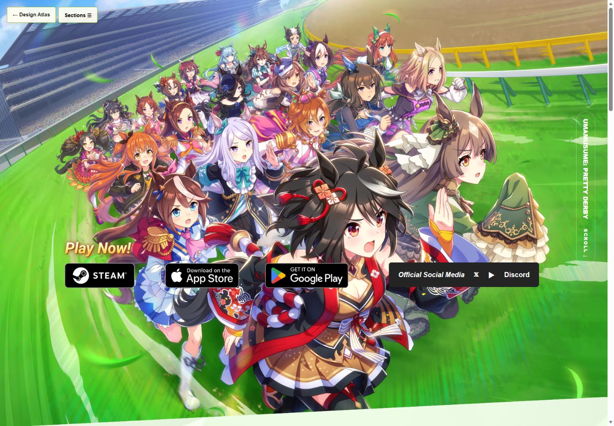</a><br><strong>赛马娘：群像赛道与斜切叙事</strong><br><sub>马蹄菜单、Logo 滚动缩放、玩法轨道与无音轨 About 影片。</sub><br><br><a href="prompts/uma-musume.md">Prompt</a> · <a href="research/uma-musume.md">研究</a> · <a href="demos/uma-musume">代码</a> · <a href="previews/mobile/uma-musume.jpg">手机预览</a></td>
<td width="33%" valign="top"><a href="https://mibxr-design-atlas.mibxranime.chatgpt.site/cases.html#style/blue-archive">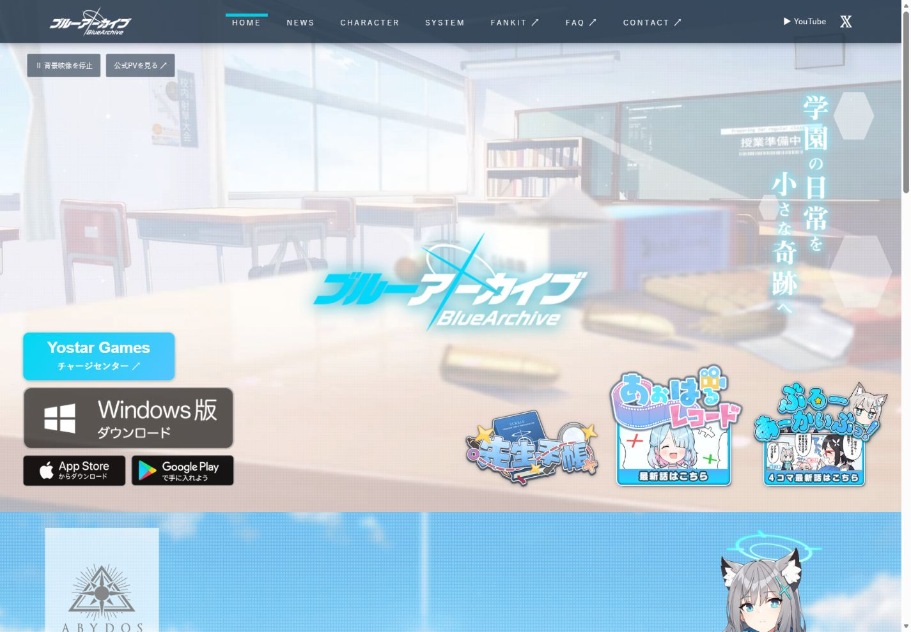</a><br><strong>碧蓝档案：学园都市的天空与光</strong><br><sub>首页与角色独立页面、人物轨道与四条官方语音。</sub><br><br><a href="prompts/blue-archive.md">Prompt</a> · <a href="research/blue-archive.md">研究</a> · <a href="demos/blue-archive">代码</a> · <a href="previews/mobile/blue-archive.jpg">手机预览</a></td>
</tr>
<tr>
<td width="33%" valign="top"><a href="https://mibxr-design-atlas.mibxranime.chatgpt.site/cases.html#style/monument-valley-game">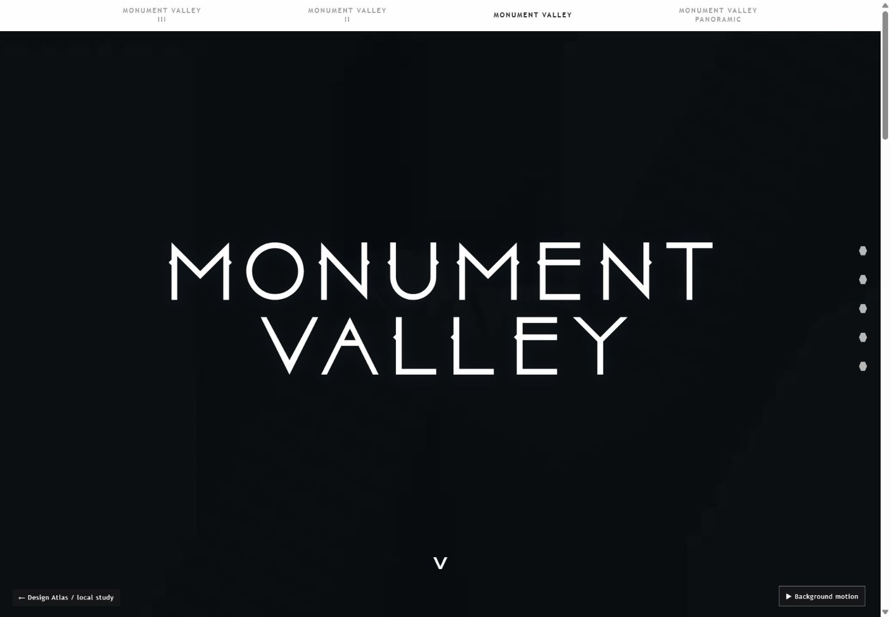</a><br><strong>纪念碑谷：电影首入、奖项进入与中心画廊</strong><br><sub>一秒加载、奖项双向进出、手机展开与十四图居中循环。</sub><br><br><a href="prompts/monument-valley-game.md">Prompt</a> · <a href="research/monument-valley-game.md">研究</a> · <a href="demos/monument-valley-game">代码</a> · <a href="previews/mobile/monument-valley-game.jpg">手机预览</a></td>
<td width="33%" valign="top"><a href="https://mibxr-design-atlas.mibxranime.chatgpt.site/cases.html#style/endfield-industrial">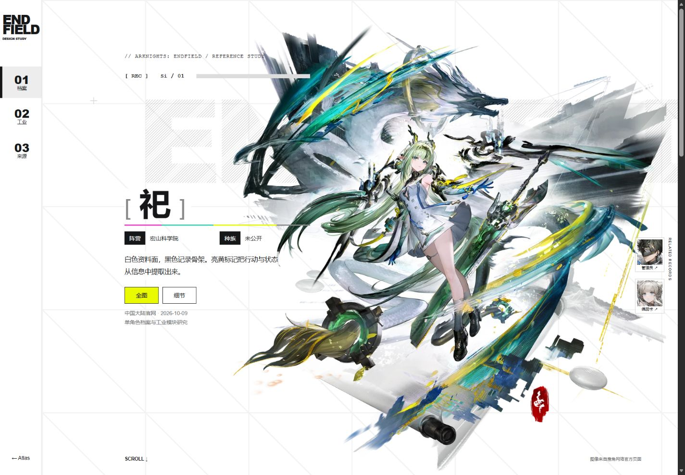</a><br><strong>终末地 · 白底工业档案</strong><br><sub>八章官网研究：真实透明视频、点云射线与分层切换。</sub><br><br><a href="prompts/endfield-industrial.md">Prompt</a> · <a href="research/endfield-industrial.md">研究</a> · <a href="demos/endfield-industrial">代码</a> · <a href="previews/mobile/endfield-industrial.jpg">手机预览</a></td>
<td width="33%" valign="top"><a href="https://mibxr-design-atlas.mibxranime.chatgpt.site/cases.html#style/rhine-lab">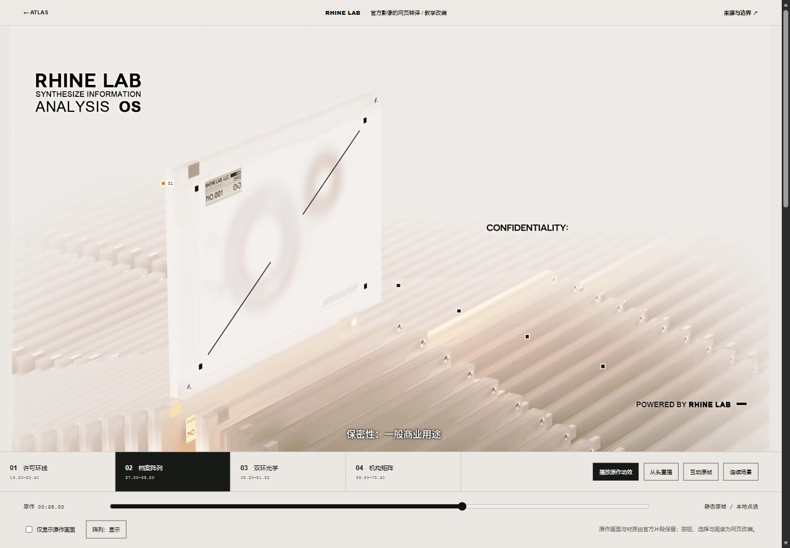</a><br><strong>莱茵生命 · 官方影像的网页转译</strong><br><sub>官方影像网页转译：米白透明档案、科室缩写与橙色信号。</sub><br><br><a href="prompts/rhine-lab.md">Prompt</a> · <a href="research/rhine-lab.md">研究</a> · <a href="demos/rhine-lab">代码</a> · <a href="previews/mobile/rhine-lab.jpg">手机预览</a></td>
</tr>
</table>

### 艺术与文化 · 9

作品、海报、摄影与活动信息决定画面的主次关系；宫殿建筑、石窟壁画与江南空间也从具体文化内容中建立识别。

<table>
<tr>
<td width="33%" valign="top"><a href="https://mibxr-design-atlas.mibxranime.chatgpt.site/cases.html#style/design-sight">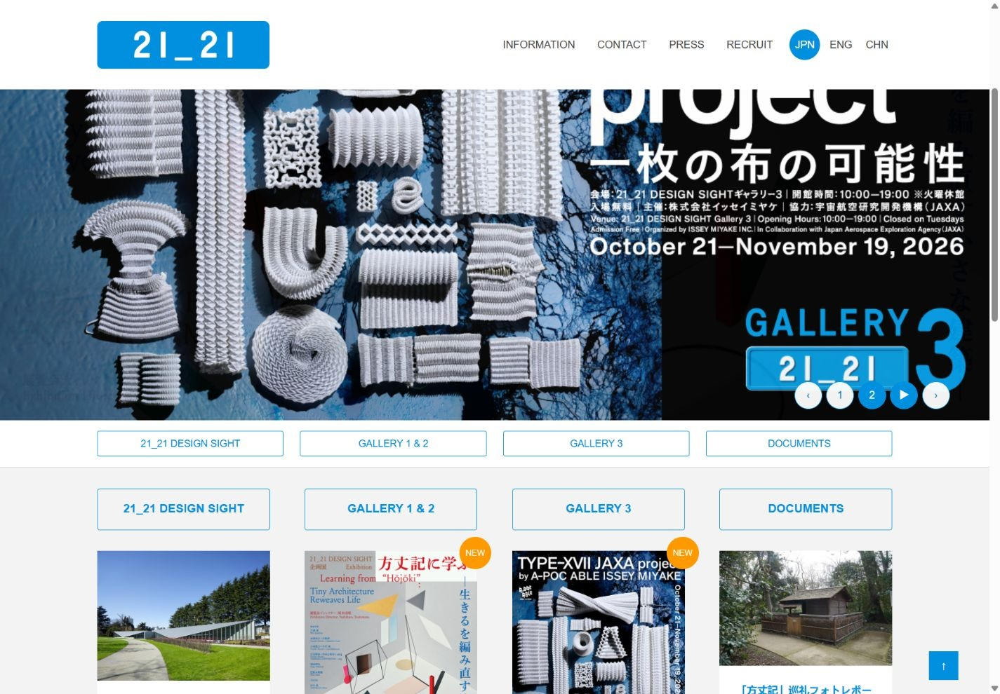</a><br><strong>21_21 DESIGN SIGHT：海报与四列档案</strong><br><sub>海报主导、双图1000ms交叉淡化与信息分层。</sub><br><br><a href="prompts/design-sight.md">Prompt</a> · <a href="research/design-sight.md">研究</a> · <a href="demos/design-sight">代码</a> · <a href="previews/mobile/design-sight.jpg">手机预览</a></td>
<td width="33%" valign="top"><a href="https://mibxr-design-atlas.mibxranime.chatgpt.site/cases.html#style/mori-art-museum">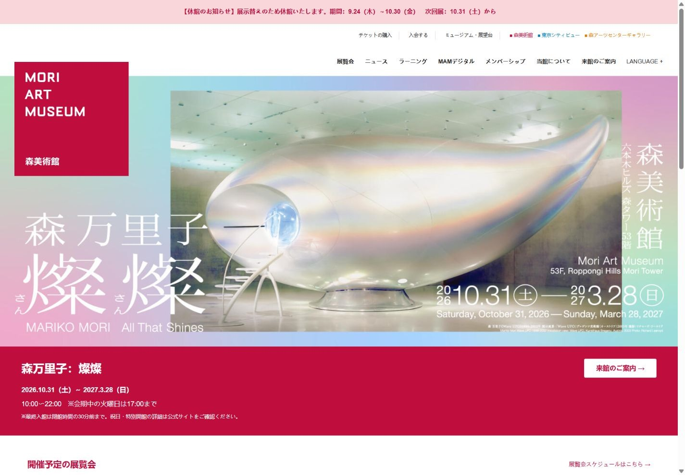</a><br><strong>森美术馆：红色机构锚点与艺术海报</strong><br><sub>大馆标与海报、滚动紧凑红导航与手机侧移菜单。</sub><br><br><a href="prompts/mori-art-museum.md">Prompt</a> · <a href="research/mori-art-museum.md">研究</a> · <a href="demos/mori-art-museum">代码</a> · <a href="previews/mobile/mori-art-museum.jpg">手机预览</a></td>
<td width="33%" valign="top"><a href="https://mibxr-design-atlas.mibxranime.chatgpt.site/cases.html#style/fuji-rock">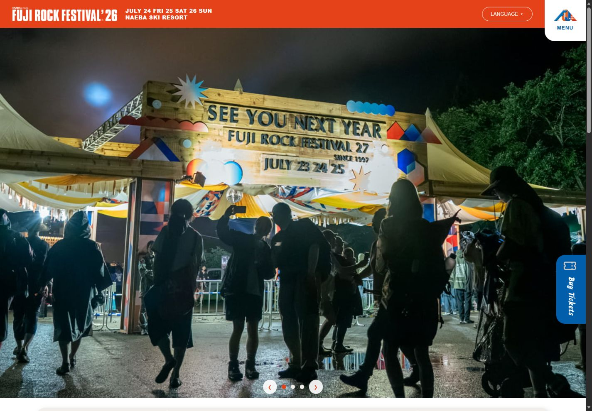</a><br><strong>Fuji Rock：现场照片与节日导览</strong><br><sub>年度海报、800ms淡化轮播与展开式大菜单。</sub><br><br><a href="prompts/fuji-rock.md">Prompt</a> · <a href="research/fuji-rock.md">研究</a> · <a href="demos/fuji-rock">代码</a> · <a href="previews/mobile/fuji-rock.jpg">手机预览</a></td>
</tr>
<tr>
<td width="33%" valign="top"><a href="https://mibxr-design-atlas.mibxranime.chatgpt.site/cases.html#style/rijksmuseum-art">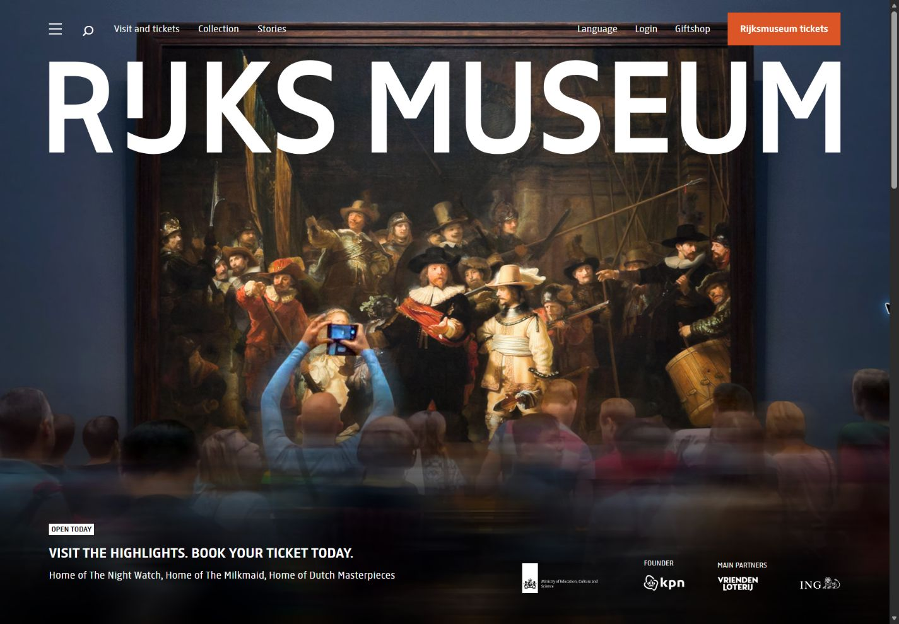</a><br><strong>Rijksmuseum · 全幅摄影与巨大字标</strong><br><sub>摄影原生浏览、巨大字标与全屏菜单淡化。</sub><br><br><a href="prompts/rijksmuseum-art.md">Prompt</a> · <a href="research/rijksmuseum-art.md">研究</a> · <a href="demos/rijksmuseum-art">代码</a> · <a href="previews/mobile/rijksmuseum-art.jpg">手机预览</a></td>
<td width="33%" valign="top"><a href="https://mibxr-design-atlas.mibxranime.chatgpt.site/cases.html#style/met-museum">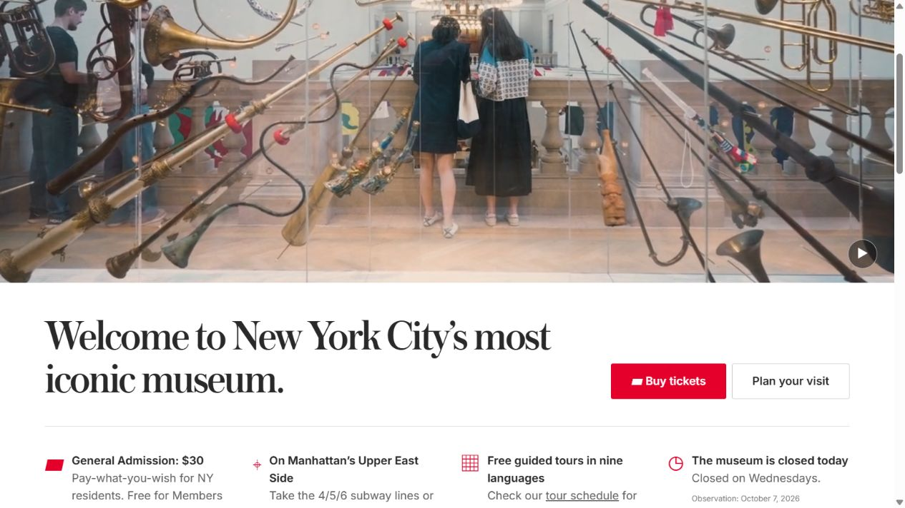</a><br><strong>The Met · 编辑式展览与馆藏陈列</strong><br><sub>官方建筑摄影、编辑标题、原生展览横架与原地展开菜单。</sub><br><br><a href="prompts/met-museum.md">Prompt</a> · <a href="research/met-museum.md">研究</a> · <a href="demos/met-museum">代码</a> · <a href="previews/mobile/met-museum.jpg">手机预览</a></td>
<td width="33%" valign="top"><a href="https://mibxr-design-atlas.mibxranime.chatgpt.site/cases.html#style/philharmonie-music">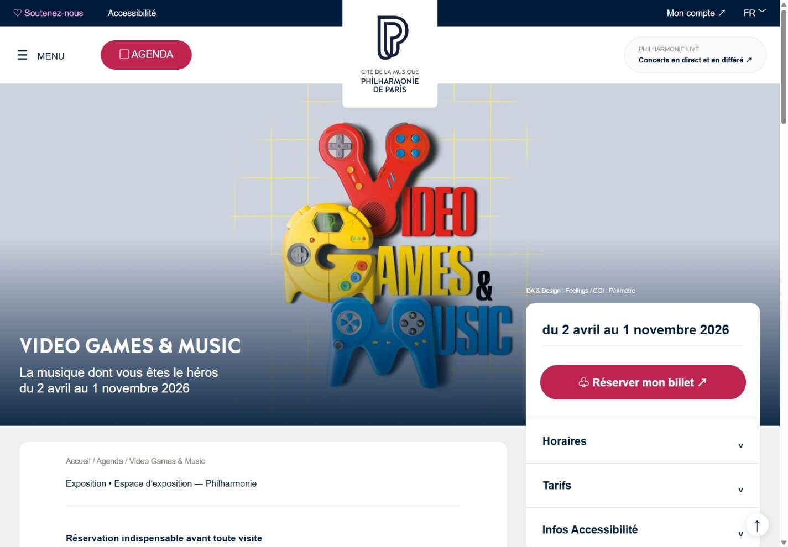</a><br><strong>巴黎爱乐厅 · 音乐展与音乐会详情</strong><br><sub>桌面固定票务、音乐会循环摄影与官方歌单。</sub><br><br><a href="prompts/philharmonie-music.md">Prompt</a> · <a href="research/philharmonie-music.md">研究</a> · <a href="demos/philharmonie-music">代码</a> · <a href="previews/mobile/philharmonie-music.jpg">手机预览</a></td>
</tr>
<tr>
<td width="33%" valign="top"><a href="https://mibxr-design-atlas.mibxranime.chatgpt.site/cases.html#style/palace-museum">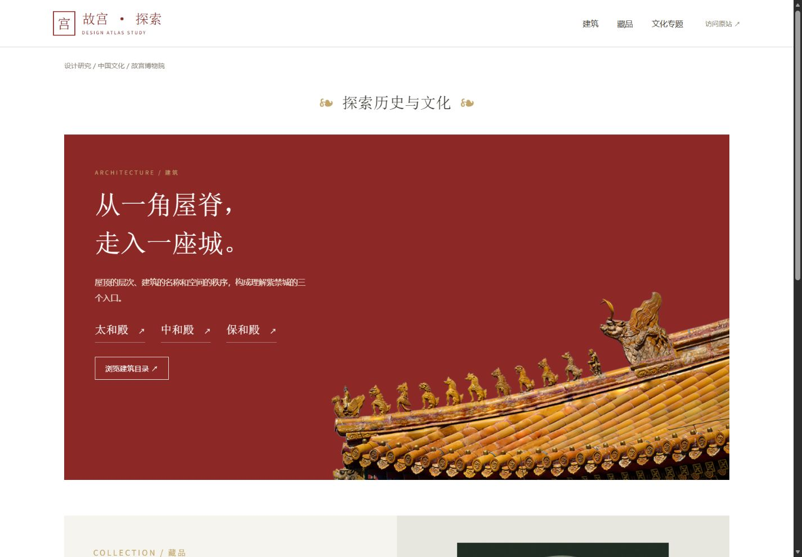</a><br><strong>故宫 · 朱红建筑锚点与纸签目录</strong><br><sub>真实屋脊锚定朱红章节，图像与半幅纸签分工。</sub><br><br><a href="prompts/palace-museum.md">Prompt</a> · <a href="research/palace-museum.md">研究</a> · <a href="demos/palace-museum">代码</a> · <a href="previews/mobile/palace-museum.jpg">手机预览</a></td>
<td width="33%" valign="top"><a href="https://mibxr-design-atlas.mibxranime.chatgpt.site/cases.html#style/digital-dunhuang">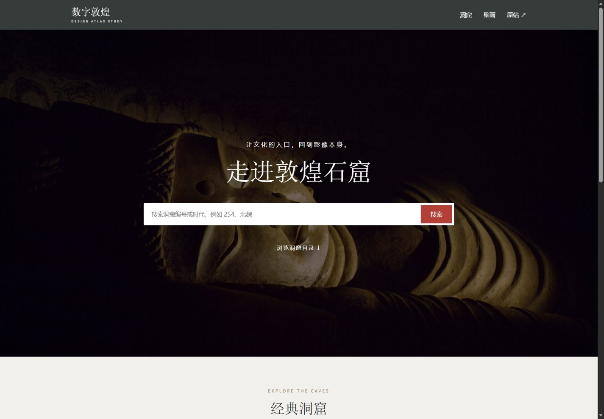</a><br><strong>数字敦煌 · 影像检索与壁画细察</strong><br><sub>原站发现、条件目录与公开壁画 Deep Zoom 三页流程。</sub><br><br><a href="prompts/digital-dunhuang.md">Prompt</a> · <a href="research/digital-dunhuang.md">研究</a> · <a href="demos/digital-dunhuang">代码</a> · <a href="previews/mobile/digital-dunhuang.jpg">手机预览</a></td>
<td width="33%" valign="top"><a href="https://mibxr-design-atlas.mibxranime.chatgpt.site/cases.html#style/suzhou-museum">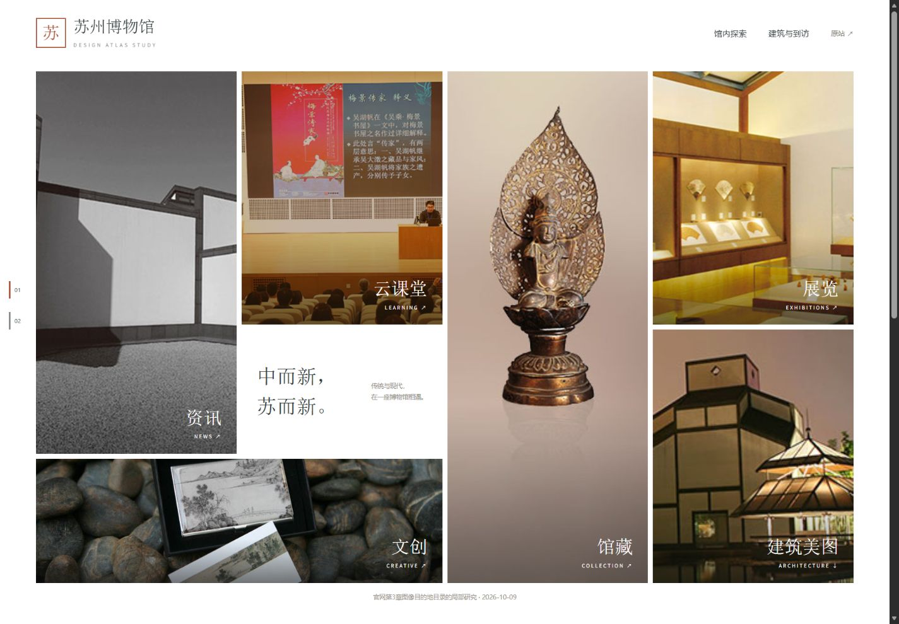</a><br><strong>苏州博物馆 · 图像目的地与江南留白</strong><br><sub>多尺度图像目的地，粉墙黛色与建筑到访章节。</sub><br><br><a href="prompts/suzhou-museum.md">Prompt</a> · <a href="research/suzhou-museum.md">研究</a> · <a href="demos/suzhou-museum">代码</a> · <a href="previews/mobile/suzhou-museum.jpg">手机预览</a></td>
</tr>
</table>

### 经典设计语言 · 8

理解构成规则和约束，再将其迁移到新的内容。

<table>
<tr>
<td width="33%" valign="top"><a href="https://mibxr-design-atlas.mibxranime.chatgpt.site/cases.html#style/hand-drawn">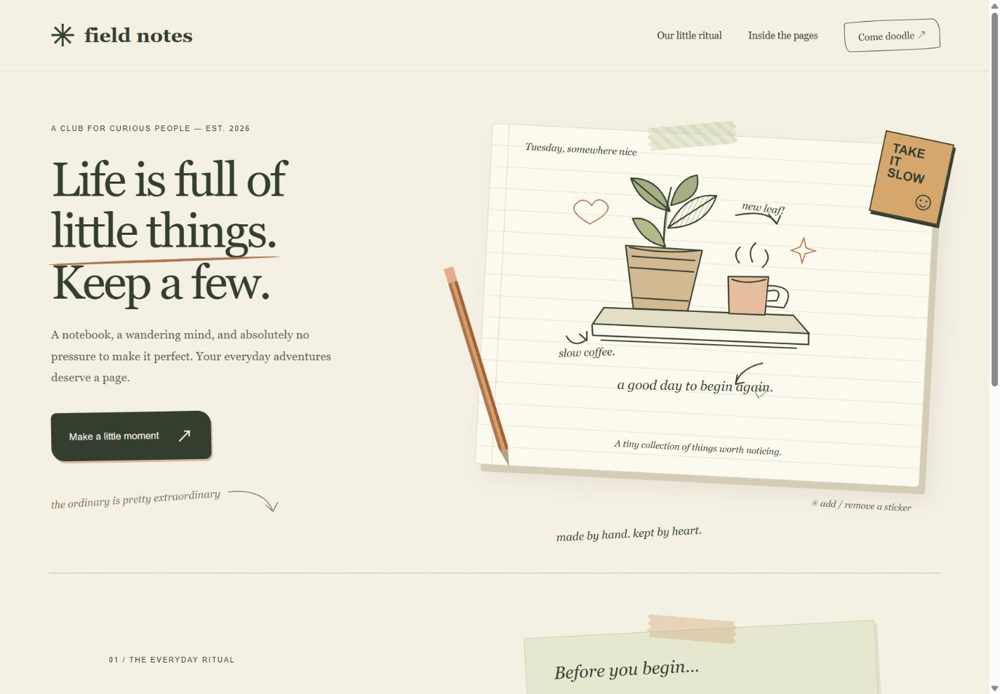</a><br><strong>手绘：把不完美变成亲近感</strong><br><sub>不完全直线、纸面质感和亲近的图文关系。</sub><br><br><a href="prompts/hand-drawn.md">Prompt</a> · <a href="research/hand-drawn.md">研究</a> · <a href="demos/hand-drawn">代码</a> · <a href="previews/mobile/hand-drawn.jpg">手机预览</a></td>
<td width="33%" valign="top"><a href="https://mibxr-design-atlas.mibxranime.chatgpt.site/cases.html#style/isometric-3d">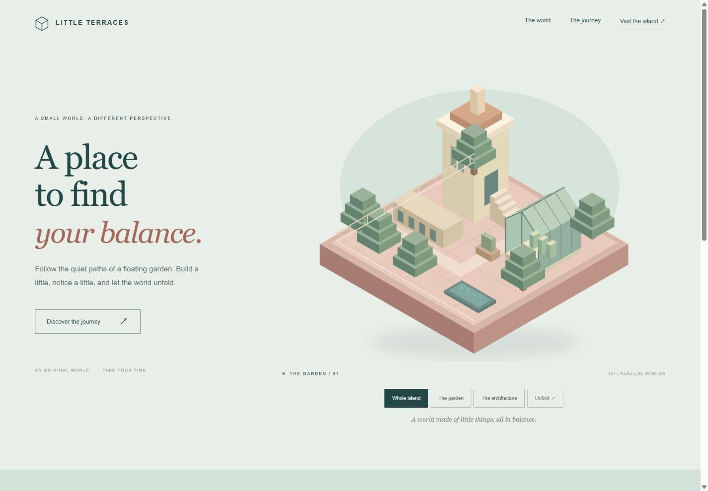</a><br><strong>等轴 3D：让空间讲述系统</strong><br><sub>统一投影、空间层次和部件的结构关联。</sub><br><br><a href="prompts/isometric-3d.md">Prompt</a> · <a href="research/isometric-3d.md">研究</a> · <a href="demos/isometric-3d">代码</a> · <a href="previews/mobile/isometric-3d.jpg">手机预览</a></td>
<td width="33%" valign="top"><a href="https://mibxr-design-atlas.mibxranime.chatgpt.site/cases.html#style/line-art">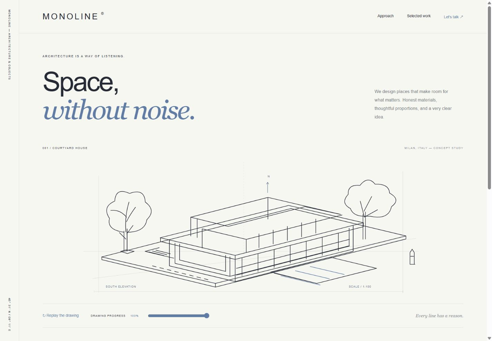</a><br><strong>线条：沿绘制顺序解释结构</strong><br><sub>单一线宽、描边绘制顺序和轻量留白。</sub><br><br><a href="prompts/line-art.md">Prompt</a> · <a href="research/line-art.md">研究</a> · <a href="demos/line-art">代码</a> · <a href="previews/mobile/line-art.jpg">手机预览</a></td>
</tr>
<tr>
<td width="33%" valign="top"><a href="https://mibxr-design-atlas.mibxranime.chatgpt.site/cases.html#style/shape-morph">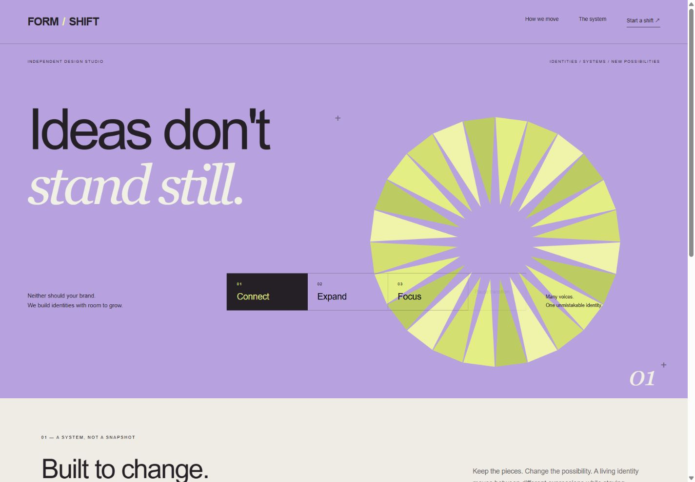</a><br><strong>动态形状：同一单元，多种表达</strong><br><sub>拓扑可兼容的形状变化与连续状态反馈。</sub><br><br><a href="prompts/shape-morph.md">Prompt</a> · <a href="research/shape-morph.md">研究</a> · <a href="demos/shape-morph">代码</a> · <a href="previews/mobile/shape-morph.jpg">手机预览</a></td>
<td width="33%" valign="top"><a href="https://mibxr-design-atlas.mibxranime.chatgpt.site/cases.html#style/swiss-grid">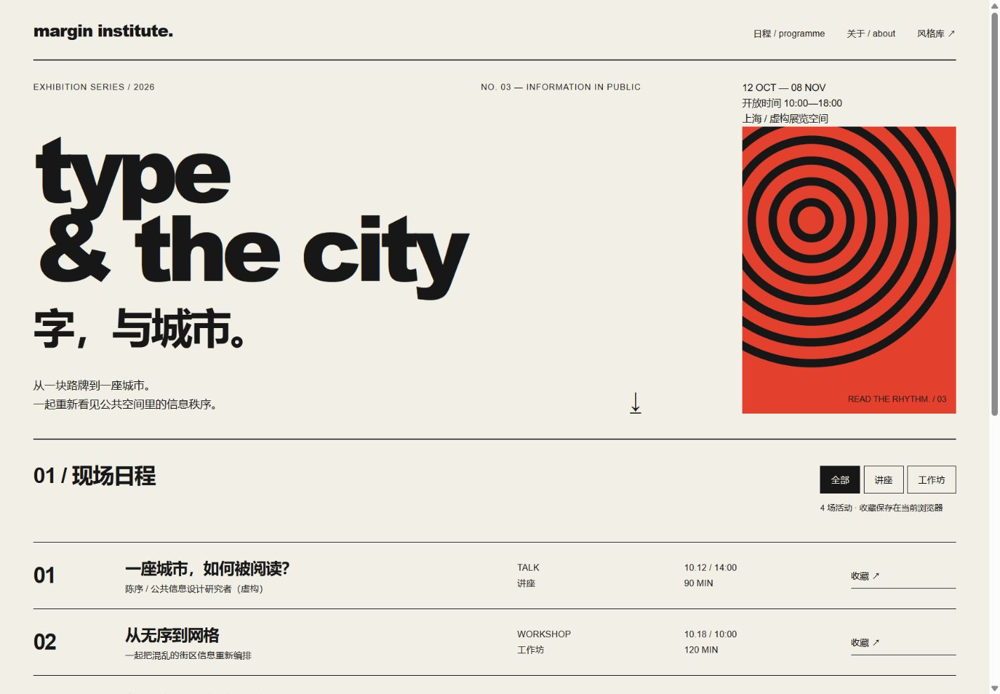</a><br><strong>瑞士设计：编辑网格</strong><br><sub>强网格、无衬线尺度和清晰编辑层级。</sub><br><br><a href="prompts/swiss-grid.md">Prompt</a> · <a href="research/swiss-grid.md">研究</a> · <a href="demos/swiss-grid">代码</a> · <a href="previews/mobile/swiss-grid.jpg">手机预览</a></td>
<td width="33%" valign="top"><a href="https://mibxr-design-atlas.mibxranime.chatgpt.site/cases.html#style/bauhaus-geometry">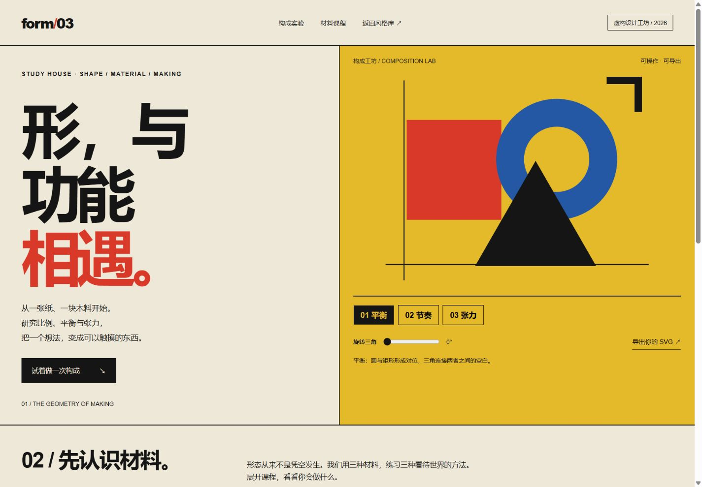</a><br><strong>包豪斯：几何与实验</strong><br><sub>基本几何、有限色盘和均衡的非对称构成。</sub><br><br><a href="prompts/bauhaus-geometry.md">Prompt</a> · <a href="research/bauhaus-geometry.md">研究</a> · <a href="demos/bauhaus-geometry">代码</a> · <a href="previews/mobile/bauhaus-geometry.jpg">手机预览</a></td>
</tr>
<tr>
<td width="33%" valign="top"><a href="https://mibxr-design-atlas.mibxranime.chatgpt.site/cases.html#style/retro-80s">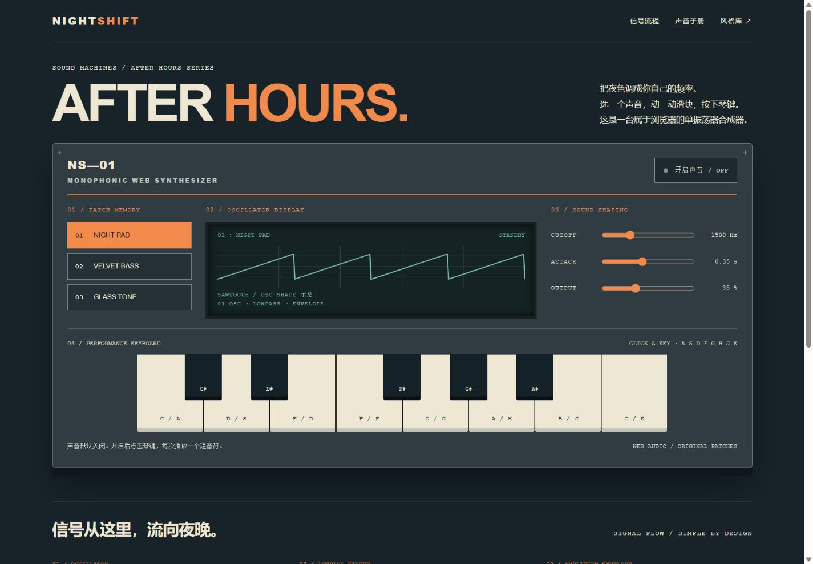</a><br><strong>80年代：合成器面板</strong><br><sub>复古硬件面板、音色预设与实时短音符反馈。</sub><br><br><a href="prompts/retro-80s.md">Prompt</a> · <a href="research/retro-80s.md">研究</a> · <a href="demos/retro-80s">代码</a> · <a href="previews/mobile/retro-80s.jpg">手机预览</a></td>
<td width="33%" valign="top"><a href="https://mibxr-design-atlas.mibxranime.chatgpt.site/cases.html#style/pixel-world">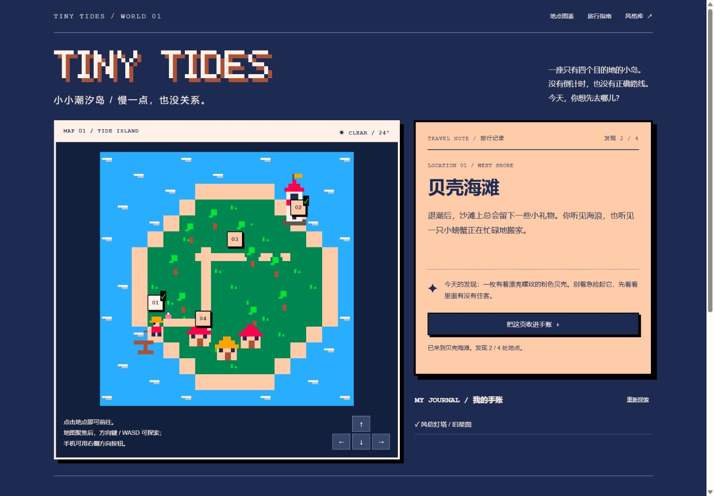</a><br><strong>像素：微型世界</strong><br><sub>整数像素网格、地点移动与可保存的旅行手账。</sub><br><br><a href="prompts/pixel-world.md">Prompt</a> · <a href="research/pixel-world.md">研究</a> · <a href="demos/pixel-world">代码</a> · <a href="previews/mobile/pixel-world.jpg">手机预览</a></td>
<td></td>
</tr>
</table>

## 设计元素怎样统一表达

| 元素 | 在画面中的作用 | 实验室中的操作 |
|---|---|---|
| 配色 | 区分背景、表面、正文、强调和反馈 | 带入案例色板、改色、比较纯色文字对比度 |
| 字体与排版 | 形成语气、阅读节奏和尺度层级 | 切换字型、布局、层级与留白 |
| 图像与图形 | 展示产品、人物、世界或作品 | 改变图形类型、比例及质感 |
| 形状与构成 | 把按钮、容器、装饰组织成一致语言 | 改变圆角／几何形状和组合 |
| 深浅主题 | 保持背景、表面、正文与强调的协调 | 参考／系统／浅色／深色切换与配置导出 |
| 动效与反馈 | 解释状态变化、引导注意、保持空间连续 | 切换动效、触发反馈，并比较静态状态 |
| 协调关系 | 让所有元素围绕同一主题和重点 | 单项混搭、加载案例方案、复制配置与 Prompt |

[设计基础研究](research/foundations.md)记录理论来源。文字对比度检查仅覆盖所选纯色组合，不能替代整页可访问性验证。地区用于具体机构与创作来源，不把一个案例概括成整个国家的固定风格。

## 复用与体验

### 本地运行

需要 **Node.js**，项目运行不需要安装第三方依赖。Windows可双击 `start.cmd`，或执行：

```bash
npm start
```

打开 [http://127.0.0.1:4173](http://127.0.0.1:4173)。`Ctrl+C` 结束服务。服务只绑定本机，建议保持固定地址；改变主机名或端口会得到独立收藏。

### 素材来源、加载与缓存

仓库保留完整原始素材。本地运行默认 `auto`：先读自身目录，已映射的大素材加载失败时，才使用固定 Git 提交中的 GitHub 备份。在完整源码／本地构建中，独立 Demo 地址可加 `?assets=local` 强制本地，或 `?assets=github` 切换动态图像、视频与声音的来源；样式表中的背景和字体保留本地地址。Sites 构建会在输出时统一将对应CSS地址也改为固定GitHub地址，因此精简Sites包不支持强制本地或离线使用。来源切换不改变布局、动效或声音设计。

复用单个真实网站 Demo 时，也需携带根目录的 `asset-sources.js`、`asset-runtime.js`、`case-loading.js/.css` 与 `asset-cache*.js`，或将这些公共模块连同引用一起迁移。入口HTML是项目的一部分，直接下载一份HTML无法包含它依赖的图像、字体和脚本。

`npm run build:site` 生成引用 GitHub 大素材的部署目录，省略对应的大文件，保持素材原字节与画质。`npm run build:local` 生成包含全部素材的静态目录，可用于完整本地托管。两种构建都不修改 `demos/` 中的原始素材。GitHub 素材固定到 `asset-sources.js` 中的完整提交 SHA，避免分支变化使代码与图片不匹配；Sites 的大素材首次下载需要网络。

首屏加载只等待当前画面必要的图片、可见字体和视频首帧，后续章节提前按需准备。进度按已就绪资源项统计，不伪造下载字节百分比；失败时可以重试或继续浏览。明日方舟与塞尔达保留自己的原站风格加载／声音入口，开场从资源就绪之后开始。音乐由用户启用，不进入首屏必等列表。

固定 GitHub 地址的大素材使用浏览器 Cache Storage 保存；后续再次进入时优先复用，完整视频缓存支持字节区间读取与拖动。嵌入预览与独立页面同属一个站点时共享这份缓存。只按访问加载，不在进入案例库时下载所有案例；素材缓存最多256MiB，按存入顺序移除较早的素材。HTML、脚本与样式照常获取当前版本。本地服务使用 ETag／Last-Modified 条件请求，未变化的本地文件返回304并复用已下载内容。

浏览器可能因空间不足、隐私模式或清理网站数据而移除缓存；此时页面正常重新加载。“收藏备份与说明”中可查看、清除素材缓存。收藏与素材缓存分别保存。Cache Storage 的容量和可用性由浏览器管理，参见 [MDN Cache](https://developer.mozilla.org/en-US/docs/Web/API/Cache)。

### 从参考到自己的设计

1. 在对应 Demo 中实际操作，读清楚原站观察与本地差异。
2. 复制 `prompts/<id>.md`，填写目标产品、内容、素材、尺寸与观察日期。
3. 保留该风格的网格、层级、比例和状态关系，再调整自己的品牌输入。
4. 对照制作约束，测试滚动、键盘、手机、音视频及减少动态效果。
5. 保存对比截图、改动理由与Git提交，让个人判断也能回看。

音频由用户启用；静音视频可播放并提供暂停。真实品牌图片、字体及本地音视频按原比例保存；Apple 的完整产品影片按需播放官方在线流，需要网络。登录、购买、预约和实际服务入口指向官网，不在本库执行。

### 收藏与迁移

收藏保存在当前站点浏览器的 `localStorage`，键为 `atlas-favorites`，内容只有案例ID。它不上传、不同步账号，也不会自动写入Git。

刷新保留；换浏览器、地址、端口或清理网站数据后，收藏不同。“收藏备份与说明”可导出JSON并粘贴导入，导入合并有效ID、去重并忽略未知条目。将导出的JSON自行纳入Git即可保存个人策展结果。

## 资料结构与维护

```text
entries/<id>.json              案例、设计元素、约束、来源、Prompt的单一数据源
prompts/<id>.md                由 entries 生成的可读 Prompt
research/<id>.md               观察、理论、分析推断、复现映射
research/screenshots/          归档页面的原站对照截图
demos/<id>/                   HTML、CSS、JS与本地图片／字体／音视频
  fidelity.md                 已复现、近似、未实现与观察限制
  assets-manifest.json        公开来源、用途、处理方式、字节数、SHA256
previews/                     案例桌面与手机预览
docs/readme/                  本README配图
docs/site/                    网站本体的实际浏览器截图
vendor/                       固定版本的Markdown解析库、HTML清理库与许可证
patterns/<id>.json            人工策展的独立巧思与体验类型
patterns.html / patterns-ui.*  独立巧思浏览、来源 Demo 与复用方法
pattern-playground.*          首页、巧思页与实验室共用的本地机制示意
fundamentals.*                可操作的设计实验室
catalog.js                    自动生成的浏览器目录
asset-sources.js               固定 Git 提交、远端URL与本地素材字节／哈希映射
asset-runtime.js               本地优先、失败回退与显式来源切换
case-loading.*                首屏就绪、开场门控与章节素材准备
asset-cache*.js                固定版本大素材缓存与视频区间读取
scripts/                      本机服务、目录生成、静态构建与资产检查
.openai/hosting.json           现有Sites项目与静态目录配置
```

`npm run build` 从 entries 更新目录、完整索引及 Prompt；`npm run check` 检查字段、来源、本地引用、JS语法、预览和资产大小／哈希。`npm run build:site` 生成引用固定 GitHub 素材的部署目录 `dist/`，不含Git元数据和本地服务。新增或修改案例遵循 [贡献流程](CONTRIBUTING.md)。

```bash
npm run build
npm run check
npm run build:site
```

### 如何判断还原范围

调研记录区分**直接观察、理论解释、本库分析**；每个品牌案例的 `fidelity.md` 标注**已还原、近似、未实现**。不能把局部实现称为完整源站克隆；对照固定为所记录的采集页面，不引入后续版本分支。

## 版权与研究边界

本库用于个人设计学习。品牌、摄影、角色、音视频和字体的权利归原作者；各案例的素材清单记录来源与许可信息。第三方素材不随代码获得商业使用许可。
