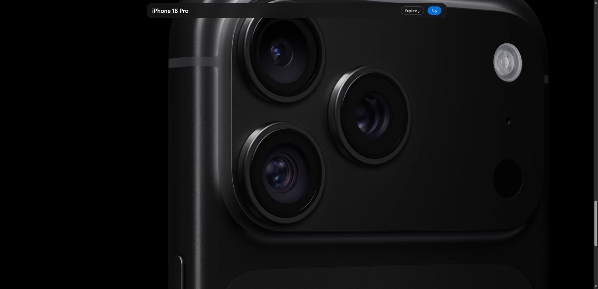

# Apple：真实摄影与滚动产品叙事

观察日期：2026-10-07。参考：[公开页面](https://www.apple.com/iphone-18-pro/)。原站内容以该日期与语言版本为准。

## 设计特点与分析

黑色全宽登场配44px导航与52px信息带；名称靠舞台左下、购买为右下蓝色胶囊。Highlights以深灰底、56px标题与大圆角摄影建立收益层级；Design用约96px标题和左侧七个细节胶囊。玻璃质感章节导航随浏览固定。

同一硬件从整体转向细节，摄影、标题尺度和负空间共同组织长叙事；固定局部导航维持方向与行动可达。这是页面分析。

## 交互机制与复现映射

| 触发与元素 | 原站观察／公开源码 | 本地实现与差异 |
|---|---|---|
| 登场／首屏 | 官方产品视频与末帧；完整自动序列未稳定观察。源容器恒定scale1.40625是fit，不是镜头动画。 | 使用官方MP4、末帧与重播；首屏无额外CSS缩放。 |
| Highlights进入视口 | 控制由translateY(180px)进入；Camera→Battery→Colors→A20 Pro→Siri AI；有限播放结束后为Replay。 | 五静帧、进度、暂停和末尾重播；每项5秒、入场.65秒为近似；专用五段媒体未迁移。 |
| 镜头滚动 | VideoScrub加载窗口a0t−250vh至a0b+100vh；进度锚点a0t−100vh至a0b−100vh，范围[.01,1]。 | 官方2160×1620、4.984秒WebM；220vh容器内sticky，p=clamp((viewportHeight−top)/height)，seek到(.01+.99p)×duration，视频保持暂停。 |
| 镜头标题 | 源视频2.31秒时标题opacity1、4.11秒时opacity0；为两处采样。 | 与视频共用滚动进度，p=.48→.73淡出是近似；减少动态使用poster与静态标题。 |
| Design选择 | 胶囊切换机身、镜头、尺寸与控件视图。 | 官方静帧与配色名称同步；完整旋转3D未实现。 |

## 理论与约束

Apple HIG Motion用于动效目的与减少动态策略，属于应用规范向网页的迁移。价格、供应与交易以官网为准；完整性能、共享功能和其他章节未覆盖。

## 来源与材料

- [Apple iPhone 官方分类页](https://www.apple.com/iphone/)（实例）：iPhone产品分类与比较入口；具体交互以iPhone 18 Pro页面为准。
- [Apple iPhone 18 Pro 产品页](https://www.apple.com/iphone-18-pro/)（实例）：2026-10-07产品页：首屏、Highlights、Design与镜头滚动；图库有限播放、暂停和末尾重播。
- [Apple HIG — Motion](https://developer.apple.com/design/human-interface-guidelines/motion)（规范）：动效目的和减少动态支持；应用规范向网页的迁移。
- [Apple 当前页样式](https://www.apple.com/v/iphone-18-pro/c/built/styles/overview.built.css)（实例）：VideoScrub容器、gallery控制与源样式，用于区分布局缩放和视频内镜头运动。
- [Apple 当前页脚本](https://www.apple.com/v/iphone-18-pro/c/built/scripts/overview/main.built.js)（实例）：VideoScrub加载窗口a0t−250vh至a0b+100vh；进度锚点a0t−100vh至a0b−100vh，范围.01至1。

[原站对照](screenshots/apple-hero-source.jpg) · [Demo](../demos/apple-product/index.html) · [完整Prompt与设计元素](../entries/apple-product.json) · [还原范围](../demos/apple-product/fidelity.md) · [资产来源](../demos/apple-product/assets-manifest.json)。品牌与媒体权利归原作者。
