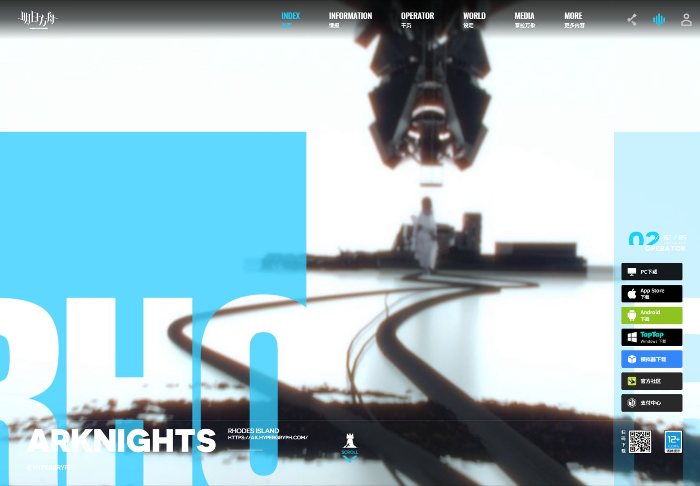

# 明日方舟 · 工业档案与干员舞台

调研日期：2026-10-07。国家：中国。实际访问：https://ak.hypergryph.com/。

## 来源与取证

- [Hypergryph · 明日方舟官方网站](https://ak.hypergryph.com/)（实例）：实访首页、OPERATOR与WORLD；核验网格、右索引、凯尔希档案、六术语以及真实 bgm.ea4286.mp3。
- [W3C · Pause, Stop, Hide](https://www.w3.org/WAI/WCAG22/Understanding/pause-stop-hide.html)（规范）：核验持续自动动态的暂停要求；本地背景视频提供可持续暂停按钮，减少动态偏好下初始停止。
- [W3C · Tabs Pattern](https://www.w3.org/WAI/ARIA/apg/patterns/tabs/)（规范）：键盘、明确选择状态与内容切换的交互规范参考；demo采用原生按钮/aria-pressed，并提供左右键选择。

## 直接观察

官网加载后首页为动态PV、左青矩形和裁切RHODES字、底部ARKNIGHTS、右下载列及编号索引。OPERATOR区当前凯尔希：灰度同人物大背景、彩色前景、左档案和配音、下人像选列、右精英阶段按钮。WORLD为六术语横线目录与右侧粒子场。资源记录发现真实bgm.ea4286.mp3；官方打包脚本提供阿米娅/陈日语语音。

## 分析与推断

工业系统感依赖一致的网格、编号与双语标签；彩色立绘和灰度同图的层次，比普通并排卡片更能聚焦角色。这是网页构成分析。

- 背景视频和超大裁切字建立工业舞台，导航、索引及档案沿网格秩序组织。
- 同一人物的灰度巨背景和彩色前景产生层次，档案放在黑底阅读区。
- 青色只承担选中、索引与声音等状态，不铺满所有元素。
- 世界设定以术语目录组织，视觉氛围进入可查询内容。

## 本地映射与约束

真实官网首屏PV背景、凯尔希/阿米娅/陈双精英阶段立绘、罗德岛阵营符号；官网实际BGM和两名干员日语语音。

- 官方素材只作本地私人学习，版权归鹰角网络。
- 本地保留3名干员，原站有6名；语音覆盖阿米娅/陈，凯尔希语音按钮明确不可用。
- 剧情介绍使用简短学习摘要，完整文本回原站。
- 本地CSS源石替代原站WebGL粒子，并明确局部差异。
- BGM与角色语音不是同一类型，不混淆曲名或配音。
- 手机重新排档案和人物，固定索引不能挡住主操作。

## 交互与可读性

- 章节导航与滚动同步右侧索引，保留原生滚动。
- 三干员选择、双精英阶段实际更换立绘；阿米娅/陈可手动播放官方日语语音。
- BGM默认关闭，点击播放/关闭；页面离开前台暂停声音。
- 世界术语目录同步更新说明，官网下载按钮去实际官方地址。

W3C资料是实现约束的参考，并非声称当前官网已完全符合全部无障碍规范。局部复现的边界、音频与素材来源见 [fidelity](../demos/arknights-world/fidelity.md) 与 [assets-manifest](../demos/arknights-world/assets-manifest.json)。

## 可复用 Prompt

为【工业科幻角色游戏】先核验真实官网的首页、干员区与世界设定，保存实访截图与公开素材来源。首屏以官方PV静音视频覆盖全幅，左侧大青色矩形与超大裁切RHODES ISLAND文字，中下部ARKNIGHTS标识、下载纵列和细线分区；顶部双语导航、右侧固定编号索引。干员区以同一官方立绘灰度放大作背景、彩色完整人物作前景，左侧档案包括英文名、中文名、阵营符号、角色配音和黑底简介，底部方形肖像选择，右侧双精英阶段按钮必须实际更换对应图片。随后用六个真实世界术语组成目录与说明，WebGL无法复现时明确局部替代。仅用青色表示选中和状态，正文维持水平、高对比。背景音乐与角色语音须来自实际核验官方文件，默认关闭、点击播放、捕获拒绝、切换人物停止旧语音、离开前台暂停。手机人物在上档案在下、索引收窄、菜单命中区可操作。全部资产本地化，输出独立代码、来源尺寸manifest、fidelity与真实双尺寸截图。

避免：不要以普通白色卡片替代工业档案；不要同一立绘换色冒充干员；不要自动出声或伪称曲名；不要把CSS晶体说成完整WebGL；不要复制账号、支付或追踪服务。

## 浏览器实测 · 2026-10-07

- 桌面设置 1440×1000、手机设置 390×844；正文/文档宽分别约 1424.8/1425 和 375.2/375 CSS px，无横向溢出。全部图像加载成功；三个场景分别检查。
- 官网首屏视频 readyState=4、duration=18.125 秒，暂停按钮使视频 paused=true。
- 官网 BGM 点击播放后时间实际从 19.88 秒推进至 48.38 秒，duration=195.651188 秒、error=null；随后关闭，paused=true。
- 阿米娅官方日语角色语音 duration=8.203265 秒、error=null，实际播放完成；它是角色台词，绝非背景音乐。凯尔希未下载的语音按钮明确禁用。
- 精英阶段实际更新立绘。手机在阿米娅选择器上按 ArrowRight，姓名更新为陈，图像为 chen-e2.png，焦点迁移至陈。世界术语“源石”按钮实际更新标题为 ORIGINIUMS、正文和展开状态。
- 桌面/手机首屏：`../previews/arknights-world.jpg`、`../previews/arknights-world-mobile.jpg`；另保存档案和世界观细节截图。

截图由 CUA 在 Edge 浏览器保存。视口设置与浏览器实际截图像素不同：桌面 JPG 约 1425×990，手机 JPG 约 375×811；不放大或伪造分辨率。音频自动播放拒绝分支与 reduced-motion 降级均在代码中处理；本次未模拟浏览器拒绝或系统 reduced-motion 设置，不将它们记为已实测。

## 2026-10-07 动效补审更新

实点operator导航与阿米娅，官网标识02 OPERATOR、Amiya E0与黑泽朋世资料出现。DOM记录translateY舞台及0/200/400/600/800/1000ms分块delay。已补纵向错开进入、精英/角色更新、语音暂停状态、独立首屏可见性检查，并修立绘覆盖按钮命中区。500ms/easing为本地曲线，不称为官方参数；WebGL世界效果、E0和全部干员不在本地范围。

本轮记录优先于初版的静态/手动实现描述。原站触发、脚本证据、实际手机/键盘验证与诚实限制见 [十例动效审计](MOTION-AUDIT-GAMES-ART-JP.md#arknights-world)。
