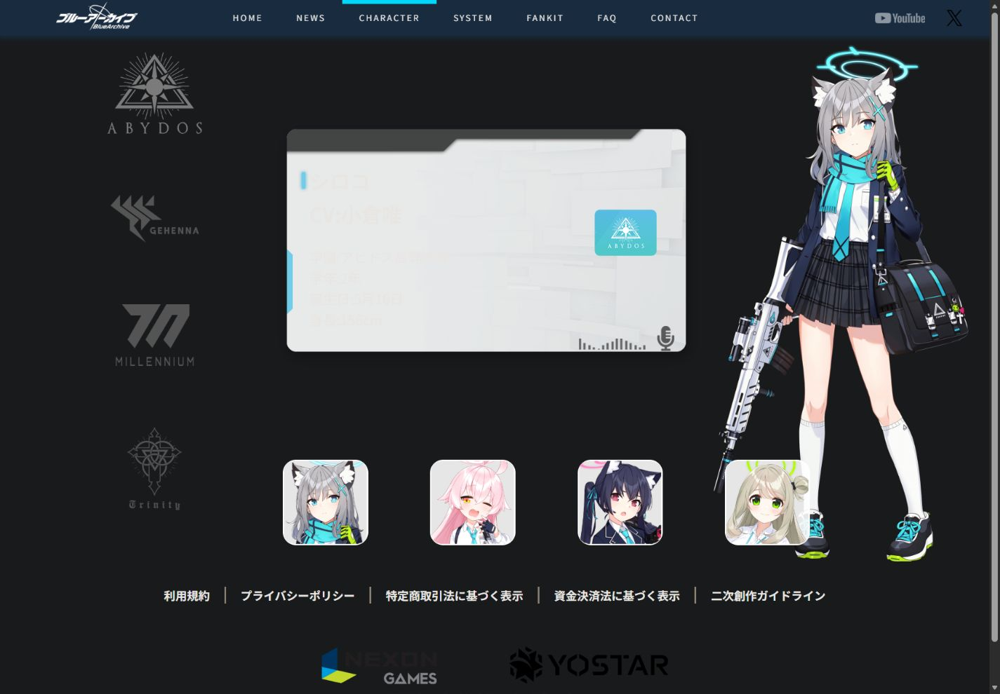

# 碧蓝档案：学园都市的天空与光

观察日期：**2026-10-07**。对象为[对应官方页面](https://bluearchive.jp/)的指定地区与版本，国别字段用于参考机构或创作者来源检索，不推断国家有固定风格。

## 参考与证据

- [Blue Archive 日本官方网站](https://bluearchive.jp/)（实例）：2026-10-07：日本发行版首页蓝白影像、Logo、竖排标语与下载/漫画入口；开发来源和地区版本分开记录。
- [Blue Archive 日本官方角色页](https://bluearchive.jp/character)（实例）：2026-10-07：学院、资料卡与立绘分层，四位阿比多斯学生的姓名/CV/学年/生日/身高以及1000ms水平轨道。
- [Blue Archive 日本官方创作指南](https://bluearchive.jp/fankit/guidelines)（规范）：官方IP创作指南入口；本地学习不因此获得全部品牌与资产的再发布许可。
- [W3C WAI：Carousels Tutorial](https://www.w3.org/WAI/tutorials/carousels/)（规范）：用户控制、键盘与当前态的规范参考；本地学生和资源观察器均为手动切换。
- [W3C：Animation from Interactions](https://www.w3.org/WAI/WCAG22/Understanding/animation-from-interactions.html)（规范）：非必要交互动效支持减少动态偏好，不据此声称完整合规。
- [官方公开角色样式 · 2026-10-07](https://webusstatic.yo-star.com/bluearchive_jp_web/css/view-character-vue.b3742afb.css)（实例）：2026-10-07：官方角色页整块Swiper过渡1000ms，Hoshino资料/CV与立绘对应；本地只含阿比多斯四人，曲线及手机重排有差异。

[原站首屏](screenshots/blue-archive-source.jpg) · [本地桌面](../previews/blue-archive.jpg) · [本地手机](../previews/mobile/blue-archive.jpg)

[官方阿比多斯学院角色资料舞台原站证据](screenshots/blue-archive-character-source.jpg)。

## 构成与设计分析

**可观察事实：**观察日本发行官网首页与/character角色页；国家字段“韩国”指开发来源NEXON Games，地区版本是日本Yostar。首页是蓝白学园都市静音影像、中央品牌字标、右竖标语，深蓝导航的当前线为青色；下载左下，漫画/帮助入口右下。角色页学院在左、资料卡居中、完整人物在右。

**本库分析：**蓝白世界先建立学园情绪，中心字标和边缘行动避免画面变成信息卡片。学院标记与个人资料使角色差异有实际内容依据，1000ms整块横移保持人物和身份的关系。

| 维度 | 设计职责与约束 |
|---|---|
| 配色 | 青色强调、白色Logo与天空高光、深蓝透明导航在同一蓝白体系中分工；漫画插画的彩色集中在角落。 |
| 字体 | 小号大字距的拉丁导航与官方日文竖排标语方向不同，中心Logo承担主辨识，正文不仿造装饰字。 |
| 版式 | 满屏城市影像与边缘下载/漫画入口 → 左学院/中资料/右人物角色舞台 → 本地资源观察器 |
| 素材 | 官方城市MP4、透明Logo、竖排标语、插画入口，以及四位阿比多斯学生的学院标记、资料卡和完整立绘，均本地保存。 |
| 形状 | 细线、半透明深蓝长导航、少量六边形光斑、熟悉商店徽章；插画入口不强制塞进统一卡片。 |
| 层级 | 背景建立世界、Logo确认产品、竖排标语补充主题；下载与漫画入口形成左右分工。 |
| 动态 | 静音城市背景普通模式播放且可暂停；阿比多斯四学生资料/立绘以1000ms整体水平轨道切换，缓动为本地近似；减少动态停止背景并即时切角色。 |
| 整体关系 | 同一青白品牌色将天空、Logo、导航指示和控件连起来，漫画的自由彩色保留在角色叙事入口，避免互相争抢。 |

## 动态机制与本地映射

| 区域 | 原站依据 | 最终本地实现与差异 |
|---|---|---|
| 城市背景 | 官网公开约7.03秒MP4作为静音连续背景。 | 普通模式静音播放且可暂停；离屏、后台停止，减少动态初始停止；未取得BGM。 |
| 角色舞台 | 官方/character可见学生切换；Swiper整块立绘/资料1000ms水平位移。 | 四位阿比多斯学生Shiroko/Hoshino/Serika/Nonomi使用官方立绘、卡片及姓名/CV/学年/生日/身高；1000ms整块轨道，缓动为本地近似。 |
| 学院与语音 | 原站包含更多学院与角色资料。 | 其他学院提供官网外链；没有取得完整语音，不制造假播放按钮。 |
| 本地学习区域 | 首页实际下载与插画入口有各自用途。 | 三态资源观察器和构图笔记明确为教学补充，不冒称原站News/System。手机菜单与较大按钮是可读性改编。 |

只实现阿比多斯四人，没有其他学院、完整语音、全档案及所有路由。手机按阅读与触控重排，不能宣称逐像素复制原移动版。官方创作指南不等于所有资产可公开再发布。

## 复用约束

- country标注韩国对应开发来源；edition标注日本版对应本次官网观察，不能混同开发国与发行地区。
- 原站背景是公开MP4，demo保持静音，普通模式可播放，减少动态初始停止；未获得BGM，不把背景视频冒称官网音乐。
- 角色范围为日本官方角色页阿比多斯四名学生；其他学院、完整语音及全部档案未覆盖。
- 官方素材和商标权利归相应权利方，私人学习不代表获准公开再发布。
- 日本站390px页面中部分按钮很小，本地手机版明确作可读性改编，非逐像素移动版复刻。
- 下部观察器和构图笔记是教学补充，不标作官网News/System原页面；所有内容无需CDN即可显示。

规范来源用于本地交互约束；除明确标注的第一方自述外，设计理念解释均为本库对选定样本的分析，不冒充品牌作者声明或整站合规结论。

## 复用入口

完整可复用描述见[Prompt](../prompts/blue-archive.md)，结构化信息见[案例条目](../entries/blue-archive.json)。[独立Demo](../demos/blue-archive/index.html)、[对应范围](../demos/blue-archive/fidelity.md)与[资产来源清单](../demos/blue-archive/assets-manifest.json)保留实现、媒体来源和限制；正文不重复一份完整Prompt。
