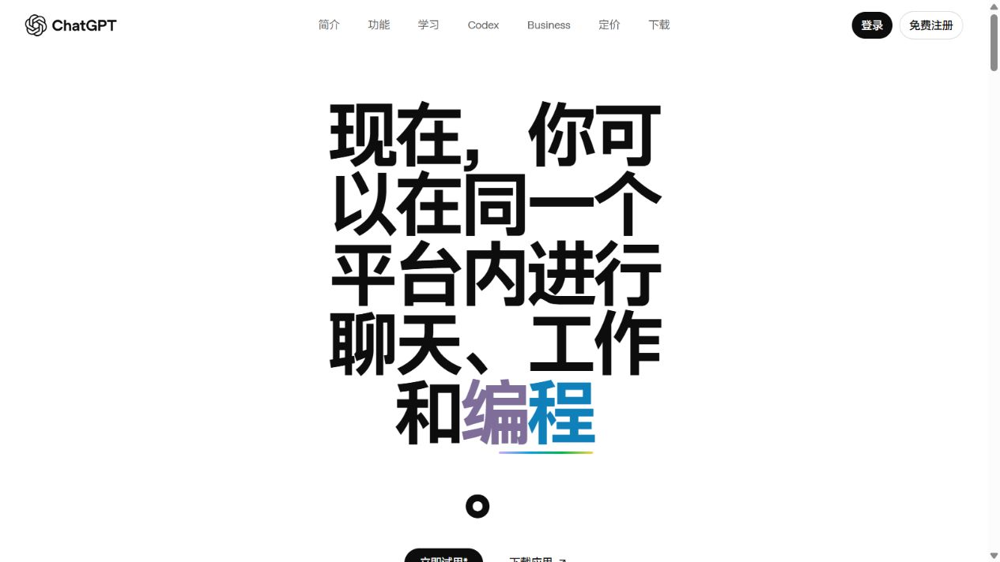
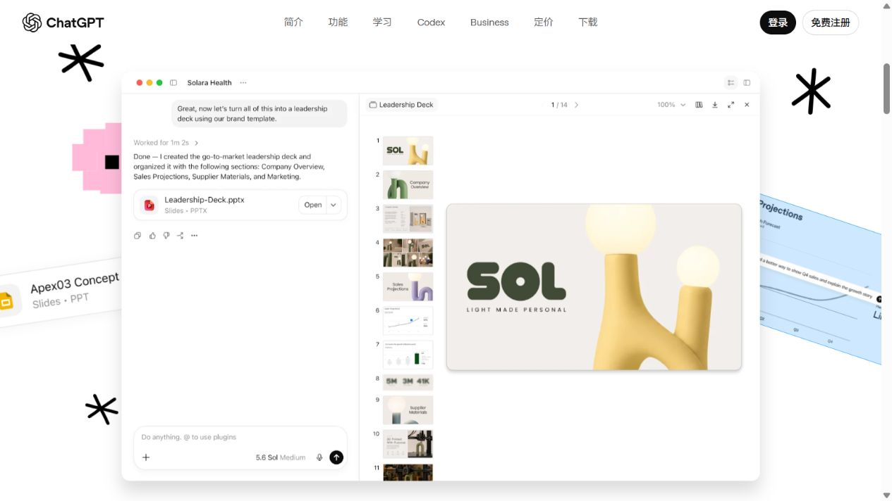
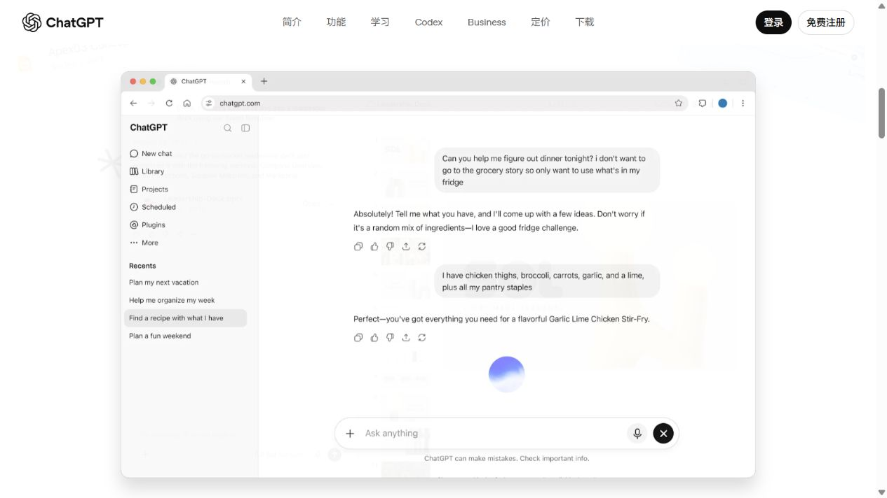
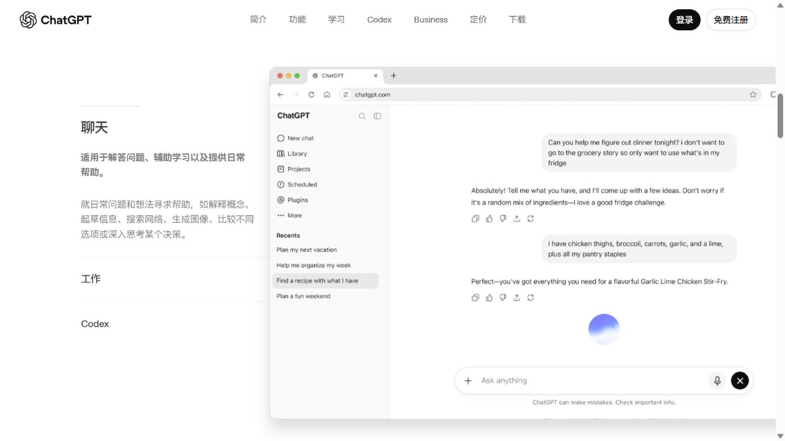

# ChatGPT · 巨字、飞入拼贴与滚动交接

观察日期：2026-10-07。参考：[中文公开介绍页](https://chatgpt.com/zh-Hans-CN/overview/)。本记录依据真实指针操作、点击与原生滚动，以及浏览器公开 DOM/CSS 属性。

## 从静态结构补回交互

首屏字体约88.96px、64px导航和五行巨字保留。关键在于标题、周边拼贴、中央界面、左侧模式说明构成同一个连续状态系统。它先让用户用几个词选择能力，再通过相同的产品窗口把注意力引向工作成果。这是本地分析，未冒充原设计团队意图。

| 原站直接观察 | 本地实现 | 边界 |
|---|---|---|
| 指针经过模式词触发切换，渐变与界面联动 | pointerenter、焦点及点击使用同一控制器 | 原站自动轮播周期未精确取得，本地6500ms |
| Chat 7 / Work 7 / Codex 6 独立图层 | 官方透明素材逐层进出、旋转与层级；快速切换限制离场组 | 进入方向和22ms交错为本地近似 |
| 图层CSS720ms及36/42/48px视差 | 分层视差、720ms进入、500ms离场、中央交叉淡化 | 未取得完整原站JS，缓动串联为本地实现 |
| intro→handoff→accordion，长段2000px+100svh | 拼贴先淡出至.96轻缩放，然后同一窗口向右下移动 | 连续插值按关键帧拟合 |
| 左侧三模式及500/1000/1500px分段 | 自然滚动联动说明；点击、方向键、Home/End | 文案缩写，保留任务含义 |
| 七用途横向图片卡片架 | 官方图片、前后按钮、触屏原生横滑 | 正文缩写，未复现完整文章 |

## 原站关键帧

可查询的图层坐标、比例、旋转、视差和滚动观测见 [motion-evidence.json](chatgpt-motion-evidence.json)。源码中的 `motion-data.js` 对应这些观察值，`script.js` 为独立本地实现。

## 使用与约束

指针经过首屏三个模式词后向下滚动，观察周围素材退出、中央窗口交接、左模式栏出现，继续滚动体验 Work/Codex；再向上滚动检查逆向流程。左模式栏可直接点击，或用方向键/Home/End。用途卡片可横滑。页脚可暂停演出。

只使用公开营销页。官方字标、图片、字体按原比例保留；不嵌入账户。手机采用顺序阅读，减少动态效果时去掉视差、自动切换及长滚动段。账户与价格按钮止于本地弹窗。价格、安全文章及完整故事画廊未全量还原。

浏览器实访与公开DOM读取成功；原站JS直接下载遇403/TLS限制。这里不声称拿到React源码或完全一致的动画曲线。

## 材料

- [Demo](../demos/chatgpt-platform/index.html) · [Prompt与设计元素](../entries/chatgpt-platform.json)
- [素材清单](../demos/chatgpt-platform/assets-manifest.json) · [还原说明](../demos/chatgpt-platform/fidelity.md)
- [OpenAI品牌规范](https://openai.com/brand/) · [WAI Accordion](https://www.w3.org/WAI/ARIA/apg/patterns/accordion/)

品牌与媒体归原作者；私人设计学习副本。
