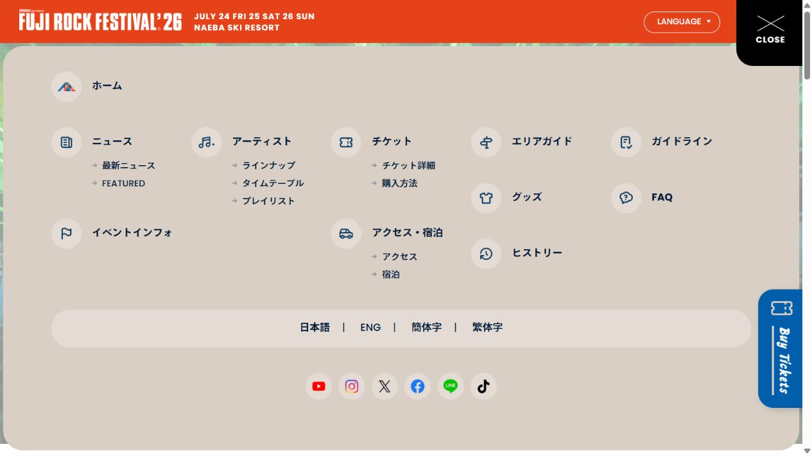

# Fuji Rock：现场照片与节日导览

观察日期：**2026-10-07**。对象为[对应官方页面](https://www.fujirockfestival.com/)的指定地区与版本，国别字段用于参考机构或创作者来源检索，不推断国家有固定风格。

## 参考与证据

- [Fuji Rock 官方首页](https://www.fujirockfestival.com/)（实例）：2026-10-07：2026首页橙色栏、山菜单、现场照片、蓝色Featured和米色新闻。
- [Fuji Rock 2026 官方结束报告](https://www.fujirockfestival.com/news/detail/fb6a67473bc9938)（实例）：2026.07.28官方结束报告；7月24–26日活动已结束，页面是年份快照。
- [IBM Design Language：Layout overview](https://www.ibm.com/design/language/layout/overview/)（理论）：关系、比例、重复和层级解释照片与导览的职责，不表示主办方采用IBM规范。
- [W3C WAI：Carousels Tutorial](https://www.w3.org/WAI/tutorials/carousels/)（规范）：自动轮播应有暂停、手动、键盘和当前状态；本地保留3.6秒轮换并提供停止。
- [官方公开交互脚本 · 2026-10-07](https://www.fujirockfestival.com/2026/assets/js/top-2026.js)（实例）：2026-10-07：主照片3600ms/800ms fade；Featured600ms/3600ms循环。菜单common.js声明601ms隐藏与wrapper退场，本地600ms/ease为近似。

[原站首屏](screenshots/fuji-rock-source.jpg) · [本地桌面](../previews/fuji-rock.jpg) · [本地手机](../previews/mobile/fuji-rock.jpg)

[官方展开式图标与多列导览菜单原站证据](screenshots/fuji-rock-menu-source.jpg)。

## 构成与设计分析

**可观察事实：**2026官网以68px橙色固定header、真实窄高白字标、右上约100px山形菜单和蓝色竖票据形成常驻导览。照片占满其余首屏；手机有专用方图。下方圆角实用导航、蓝色Featured、米色News和Content各有结构。活动日期7月24–26日，官方7月28日结束报告证明该版本是已结束快照。

**本库分析：**人群、舞台和自然环境提供节日情绪，稳定橙蓝操作层让不同照片仍属于同一活动。导览菜单用图标与层级而不是统一卡片，内容列表为回看提供安静的信息节奏。

| 维度 | 设计职责与约束 |
|---|---|
| 配色 | #e64219橙贯穿header/日期，#0075ba蓝用于导览/Featured/票据，#f2efeb与#e3dbd4使菜单层级清晰。 |
| 字体 | 真实窄高Logo、短粗日期、大英文栏目、较小日文链接；不引入原站未提供的花体字。 |
| 版式 | 68px固定顶栏、右上100px山菜单、满视口照片、右竖票据；后续横向Featured与新闻列表避免同构。 |
| 素材 | 真实官方现场照片的desktop/mobile版本、Featured宣传图、Logo和导航图标全部本地化。 |
| 形状 | 山Logo、右下圆角菜单、蓝竖票据、圆点、圆角导航/大菜单重复形成可识别操作语法。 |
| 层级 | 日期地点保持常驻，照片先传递场景，实用入口其次，Featured与按日期排列新闻承担浏览与回看。 |
| 动态 | 三组照片3600ms自动间隔、800ms cubic-bezier(.25,1,.5,1)淡化对应官网；600ms菜单及背景退场为本地近似。手动/离屏/后台停止自动，减少动态即时操作。 |
| 整体关系 | 官方现场的蓝橙布置与网站橙蓝识别呼应，灰米面板降密度；不同照片共享导航与控件位置。 |

## 动态机制与本地映射

| 区域 | 原站依据 | 最终本地实现与差异 |
|---|---|---|
| 主视觉照片 | top-2026.js为fade、speed800、interval3600，曲线cubic-bezier(.25,1,.5,1)；原站20张。 | 三组官方desktop/mobile配对照片保持3600ms/800ms曲线；箭头/圆点/键盘同步，手动后暂停，可恢复；离屏、后台及减少动态停自动。 |
| 大菜单 | 多列图标层级；common.js有601ms后隐藏菜单及wrapper退场。 | 600ms ease菜单进退与背景opacity .08/12px退场为本地近似；打开后正文/footer inert，Escape关闭回到按钮。 |
| Featured | 原站六条，600ms循环水平轨道，3600ms自动间隔。 | 四条真实宣传图原生横滚和有界按钮，不实现源站完整循环/自动轨道。 |

没有20张全部照片、六条完整Featured、导航上滑回显、加载遮罩、交易与演出数据库。未取得独立BGM；Aftermovie为官方YouTube外链，用户主动观看。系统字体近似原站Poppins/日文字体。

## 复用约束

- 明确2026版快照学习，7月24–26日活动已结束；保留购票入口只是官网参考，不能当可购买当前活动。
- 使用真实Logo/山形标识/现场照片，品牌商标与摄影权利归SMASH等原权利人。
- 手机使用官方1200×1200图片，不单纯裁切1400×700桌面照片。
- 原站20张照片/6条特集，本地3张/4条；照片保持自动淡化且可暂停，Featured为手动横滚。
- 没有取得独立官网BGM；本地不自动加载视频/音频，官方回顾需明确用户动作。
- 本地不复制原站交易、广告追踪、自动加载遮罩和完整演出数据库。

规范来源用于本地交互约束；除明确标注的第一方自述外，设计理念解释均为本库对选定样本的分析，不冒充品牌作者声明或整站合规结论。

## 复用入口

完整可复用描述见[Prompt](../prompts/fuji-rock.md)，结构化信息见[案例条目](../entries/fuji-rock.json)。[独立Demo](../demos/fuji-rock/index.html)、[对应范围](../demos/fuji-rock/fidelity.md)与[资产来源清单](../demos/fuji-rock/assets-manifest.json)保留实现、媒体来源和限制；正文不重复一份完整Prompt。
