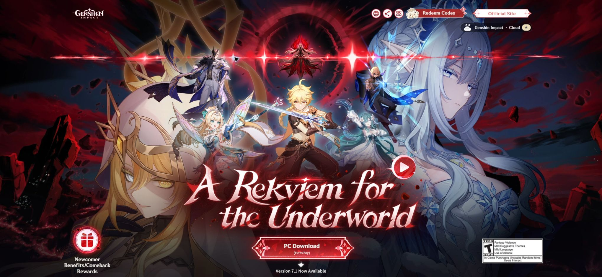

# 原神 · 版本群像与角色舞台

调研日期：2026-10-07。国家：中国。实际访问：https://genshin.hoyoverse.com/en/。

## 来源与取证

- [Genshin Impact · 当前国际官网根入口](https://genshin.hoyoverse.com/en/)（实例）：2026-10-07 浏览器确认当前7.1专题、深红群像、青绿角色模块和活动日历；旧 /home 实际404。
- [W3C · Pause, Stop, Hide](https://www.w3.org/WAI/WCAG22/Understanding/pause-stop-hide.html)（规范）：核验持续自动动态的暂停要求；本地背景视频提供可持续暂停按钮，减少动态偏好下初始停止。
- [W3C · Modal Dialog Pattern](https://www.w3.org/WAI/ARIA/apg/patterns/dialog-modal/)（规范）：对话框关闭、焦点和键盘语义的参考；demo使用原生dialog。

## 直接观察

国际 /en/home 与国内 /main/ 在浏览器显示官方404。国际根入口 /en/ 实际显示 A Rekviem for the Underworld，Version 7.1 Now Available；深红全幅人物群像、白红衬线巨标题、播放圆环、HoYoPlay下载。向下进入青绿角色舞台，首位角色名 Vesna，右侧巨立绘、圆形选择、星级、View More与固定下载条。页面后续有官方活动日历。

## 分析与推断

版本群像先建立剧情张力，角色页换色让高密度美术得到喘息；尖角、星芒、圆轨、衬线保持幻想主题。这是观察后的构成判断，不代表官方设计声明。

- 先核验有效路由；旧 /en/home 与国内 /main/ 不能作为当前页面证据。
- 首屏多人物满幅主视觉，让版本剧情与角色先于功能文案出现。
- 深红版本氛围切换到青绿角色页，颜色对应叙事章节。
- 角色立绘、装饰纹样、星级与圆形选择共同形成游戏界面语汇。

## 本地映射与约束

使用当前官方 A Rekviem for the Underworld 主题标题、真实满幅画面、当前两张角色立绘与活动日历。

- 只复现当前7.1专题的局部区域，不将旧官方404页伪称首页。
- 品牌美术版权归 HoYoverse/miHoYo，使用范围为用户授权私人研究。
- 本地主视觉mp4只有3秒且无音轨，不标作原站有声PV。
- 未完成第二角色文字资料核验时明确边界，不编造姓名或技能。
- 手机重新排人物和文字，不缩小整张桌面海报。
- 日历文字来自官方图片，替代文字明确用途并可放大。

## 交互与可读性

- 背景短片可手动暂停，减少动态偏好初始停止。
- 两张官方角色立绘实际切换，详情按钮打开可关闭对话框。
- 日历点击放大，下载前往 HoYoPlay 官方入口。

W3C资料是实现约束的参考，并非声称当前官网已完全符合全部无障碍规范。局部复现的边界、音频与素材来源见 [fidelity](../demos/genshin-world/fidelity.md) 与 [assets-manifest](../demos/genshin-world/assets-manifest.json)。

## 可复用 Prompt

为【大型游戏版本专题】先实访当前官方有效入口，记录版本、URL和取证日期；不要把过时的/home路由和404作为首页证据。首屏用核验的官方多角色满幅主视觉、深红暗紫版本色、巨幅衬线主题字、独立圆形视频控制、尖角下载按钮与版本号，保留低密度导航。滚动进入一个明确换色的青绿金边角色舞台：右侧巨幅独立立绘，左侧角色名、星级、装饰分隔、详情入口和人物圆形选择，底部下载横条维持产品行动。最后展示官方活动日历，点击可在原生dialog中放大；人物详情同样可关闭并支持Escape。所有图片与实际短片保存本地、记录源URL和尺寸；缺少已核验角色文案时明说局部范围。视频必须可持续暂停且reduced-motion下初始停止；若短片无音轨，不伪装为有声PV，使用真实原站链接。移动端改排人物/正文，控制可触摸，保留自然滚动。输出HTML/CSS/JS、资产manifest、fidelity.md和两尺寸真实预览。

避免：不要用蓝色通用SaaS hero替代深红角色群像；不要编造当前角色名、版本或曲目；不要冒充完整官网、领奖、登录或购买流程；不要复制追踪脚本。

## 浏览器实测 · 2026-10-07

- 桌面设置 1440×1000、手机设置 390×844；正文/文档宽分别约 1424.8/1425 和 375.2/375 CSS px，无横向溢出。CDN 返回的 WebP 已使用正确扩展名，图像全部加载。
- 首屏官方视频 readyState=4、duration=3 秒，FFmpeg 核验无音轨；未将它描述为有声 BGM。
- 点击第二角色使立绘实际变为 character-2.webp、名称变为“官方第二角色”；由于本次未独立核验其公开名字，保留这个事实边界。
- 详情与官方版本日历原生 dialog 实际打开；Escape 关闭详情，关闭日历后焦点返回打开按钮。
- 桌面与手机真实截图：`../previews/genshin-world.jpg`、`../previews/genshin-world-mobile.jpg`。

截图由 CUA 在 Edge 浏览器保存。视口设置与浏览器实际截图像素不同：桌面 JPG 约 1425×990，手机 JPG 约 375×811；不放大或伪造分辨率。音频自动播放拒绝分支与 reduced-motion 降级均在代码中处理；本次未模拟浏览器拒绝或系统 reduced-motion 设置，不将它们记为已实测。
