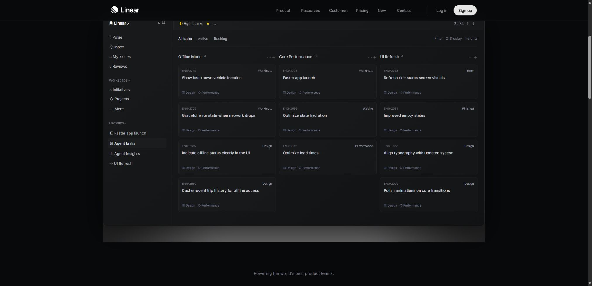

# Linear：深色产品开发系统

观察日期：2026-10-07。参考：[公开页面](https://linear.app/)。原站内容以该日期与语言版本为准。

## 设计特点与分析

64px左对齐标题先定位团队与agents产品开发系统；灰色副文、New Loops入口与细边框退到次级。紧接三栏issue演示：Pulse/Inbox侧栏、Faster app launch、正文/活动评论和属性。官方Inter、头像与黑白氛围图保持真实产品语气。

任务信息优先，项目色与状态色承担识别；收件、任务与规划章节沿工作流推进。2024/2026设计文章讲应用UI，其层级原则可迁移，不能作为营销首页每个组件的作者意图。

## 交互机制与复现映射

| 触发与元素 | 原站观察／公开源码 | 本地实现与差异 |
|---|---|---|
| Favorites点击 | Agent tasks为Offline Mode/Core Performance/UI Refresh三列11任务；Insights为3389/1128/729统计、assignee图与项目表；UI Refresh为项目overview。 | issue、看板、insights六行表、项目页四种独立结构，直接切换；未测得额外过渡。 |
| Product指针进入 | 展开Intake/Plan/AI/Build链接。 | 指针、点击、键盘与Esc；160ms局部缩放淡入为近似。 |
| Working标签 | 源CSS的agentLabelSweep/agentBorderSweep为2秒linear。 | 只保留任务Working文字的局部扫光；减少动态关闭。 |
| Intake下滚 | Slack式对话浮窗；消息opacity0/1分阶段变化，输入区有低透明状态。 | 下方Triage保留简化请求示例；完整自动消息与浮动agent面板未实现。 |
| 任务与资源 | 工作视图表达不同层级。 | 状态、收藏、Run agent、任务卡和项目资源产生本地反馈；不连接真实工作空间。 |

## 理论与约束

WAI Tabs用于选择状态和键盘。手机收束侧栏与次级属性，保留核心内容；后续图表分布和示例数据为局部近似，完整AI/automations、发布章节与实时执行未覆盖。

## 来源与材料

- [Linear 首页](https://linear.app/)（实例）：2026-10-07首页：64px标题、issue演示；Favorites切换三列看板、insights和project；Product指针进入展开。
- [Linear 2026 design refresh](https://linear.app/now/behind-the-latest-design-refresh)（理论）：2026-03-12应用UI设计：导航退后、低饱和、内容优先；用于层级分析。
- [Linear UI redesign](https://linear.app/now/how-we-redesigned-the-linear-ui)（理论）：2024应用界面改版文章，辅助解释信息层级。
- [WAI Tabs Pattern](https://www.w3.org/WAI/ARIA/apg/patterns/tabs/)（规范）：任务与分类选择的键盘和选择状态参考。
- [Linear 当前主页组件样式](https://static.linear.app/web/_next/static/css/Dop5ZgCE.css)（实例）：Working的agentLabelSweep/agentBorderSweep为2秒linear；Intake消息opacity分阶段变化。

[原站对照](screenshots/linear-workflow-source.png) · [Demo](../demos/linear-workflow/index.html) · [完整Prompt与设计元素](../entries/linear-workflow.json) · [还原范围](../demos/linear-workflow/fidelity.md) · [资产来源](../demos/linear-workflow/assets-manifest.json)。品牌与媒体权利归原作者。
