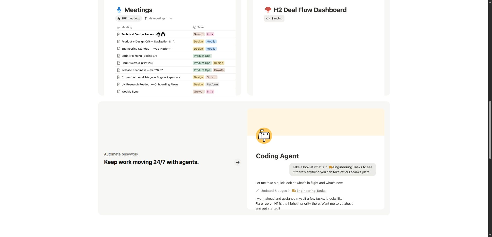

# Notion：插画与真实工作空间

观察日期：2026-10-07。参考：[公开页面](https://www.notion.com/)。原站内容以该日期与语言版本为准。

## 设计特点与分析

白底、约94px居中巨字、浅蓝动作胶囊、蓝色主按钮与Ramp HQ团队插画形成首屏；官方工作空间视频承接产品证据。Capture/Find两列bento与下一整行Automate保持不同信息权重。

人物情境与真实工具互相解释；动作词的颜色与宽度确认当前主张，稳定的文档画面承担功能说明。这是页面分析；品牌活动文章解释插画传播，应用排版文章解释文档阅读，二者范围分别保留。

## 交互机制与复现映射

| 触发与元素 | 原站观察／公开源码 | 本地实现与差异 |
|---|---|---|
| 标题自动轮换 | 公开脚本顺序Think/Ship/Create/Build/Jam/Scale、setInterval2500，颜色为蓝/绿/橙/黄/紫/青。 | 六词每2500ms轮换；点击下一项为本地扩展；减少动态停止自动。 |
| 胶囊宽度 | 按内容scrollWidth测宽；mask内inline-size以300ms cubic-bezier(.86,0,.07,1)过渡。 | 同样内容测宽与过渡，字体加载后重测；自动标题不持续aria-live广播。 |
| 视频与浏览 | 官方web-homepage-hero-1920x1200_final.mp4，10.966667秒、静音循环；越过首屏仍播放，Pause后为Play。 | 同一视频自然循环，真实media事件更新按钮；减少动态默认暂停，手机采用官方移动图。 |
| Product点击 | 打开Features及Capture/Find/Automate；hover展开未确认。 | 点击分类菜单；无需为整页添加统一浮入。 |
| 能力区 | Capture/Find双列、Automate整行。 | 保持bento分工，手机单列；问答、文档和agent反馈明确为本地示例。 |

## 理论与约束

官方插画、字标和NotionInter保持比例。完整客户墙、真实搜索、agent执行和后续能力未全量复现；视频不采用滚动换帧。

## 来源与材料

- [Notion 当前首页](https://www.notion.com/)（实例）：2026-10-07首页：六词轮换、Product点击、Capture/Find双列与Automate整行、视频播放/暂停。
- [Notion brand campaign](https://www.notion.com/blog/the-thinking-behind-our-latest-brand-campaign)（理论）：2024品牌活动文章解释插画的手势和叙事情境。
- [Notion page design update](https://www.notion.com/blog/updating-the-design-of-notion-pages)（理论）：2026-03-18应用页面的阅读间距与列表分组；用于本地文档示例。
- [Notion 当前标题脚本](https://www.notion.com/_next/static/chunks/1dh2_szm1xs0g.js)（实例）：六词顺序和setInterval2500，内容测宽机制。
- [Notion 当前标题样式](https://www.notion.com/_next/static/chunks/40jeqhz4ax8oh.css)（实例）：标签宽度300ms cubic-bezier(.86,0,.07,1)及对应组件样式。

[原站对照](screenshots/notion-editorial-source.png) · [Demo](../demos/notion-editorial/index.html) · [完整Prompt与设计元素](../entries/notion-editorial.json) · [还原范围](../demos/notion-editorial/fidelity.md) · [资产来源](../demos/notion-editorial/assets-manifest.json)。品牌与媒体权利归原作者。
