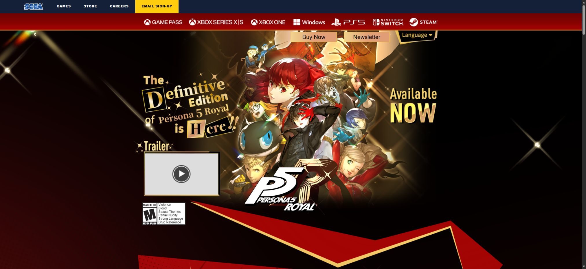

# Persona 5 Royal · 黑金角色拼贴

调研日期：2026-10-07。国家：日本。实际访问：https://persona.atlus.com/p5r/?lang=en#。

## 来源与取证

- [ATLUS · Persona 5 Royal 官方英文页](https://persona.atlus.com/p5r/?lang=en#)（实例）：浏览器核验当前金黑群像首屏、左PV、Available Now、暗红网点角色区与服装切换。
- [MoMA · Collage](https://www.moma.org/collection/terms/collage)（理论）：拼贴作品与术语资料，用于分析切片、群像和整体组织；并非 ATLUS 作者意图声明。
- [W3C · Tabs Pattern](https://www.w3.org/WAI/ARIA/apg/patterns/tabs/)（规范）：键盘、明确选择状态与内容切换的交互规范参考；demo采用原生按钮/aria-pressed，并提供左右键选择。

## 直接观察

当前英文 Royal 官网：SEGA 顶条、红色平台条；黑金首屏，中心群像，左金色剪貼标题与PV、右 Available Now、中央下部 P5R Logo。角色区切入暗红网点，巨型主人公与阿尔赛纳，左档案、底部人物肖像、右学校制服/怪盗服切换。

## 分析与推断

拼贴并非任意旋转一切；群像提供统一焦点，左侧可读档案与黑底金框建立阅读轴。Royal 的金色强调与都市怪盗红色在不同章节分工。这是对构成的分析。

- 首屏黑金群像、金色剪貼字与红色斜切衔接，不把所有页段误做同一红色。
- 角色轮廓、Persona与身份标签组成有层次的视觉焦点。
- 倾斜与切片用于海报和背景，正文及控件保持可读。
- 角色选择必须替换真实角色图与独立Persona，而非只换同一插画颜色。

## 本地映射与约束

官方 Royal 群像、真实主人公/龙司/杏及各自制服、怪盗服、对应Persona；昼夜两种生活以官方游戏截图连接。

- 真实 ATLUS/SEGA 美术仅用于用户授权私人研究。
- 只保留三名角色而非原站完整十人档案。
- 正文不随背景倾斜，选择状态明确且键盘可操作。
- 不自动轮播，不加入高频闪烁。
- 原站未核验独立 BGM，PV使用实际官网英文视频链接。

## 交互与可读性

- 三角色切换同步姓名、身份、配音、真实立绘与Persona。
- 学校制服/怪盗服两个独立素材真实切换。
- PV按钮进入官网脚本所用英文 YouTube 宣传片；不伪称本地BGM。

W3C资料是实现约束的参考，并非声称当前官网已完全符合全部无障碍规范。局部复现的边界、音频与素材来源见 [fidelity](../demos/persona-kinetic/fidelity.md) 与 [assets-manifest](../demos/persona-kinetic/assets-manifest.json)。

## 可复用 Prompt

为【角色IP游戏】制作对应真实官网的私人学习局部复现，先实访当前地区/语言版本，不根据记忆把 Royal 首页误做成红色。保留首屏黑金大型群像、左侧金色剪贴标题与PV入口、右侧发行信息、中央底部品牌Logo，以及通往红色半调角色章节的斜切金边。角色区必须使用分别核验的真实角色、学校服装、怪盗服装和对应Persona图片，前景人物与后景Persona分层，左侧黑底金框档案提供姓名、身份、配音及简介，底部肖像选择、右侧服装按钮都有真实内容变化。接着用真实截图组成学校生活与怪盗生活两个倾斜画面，再提供官方平台链接。只有标题和海报容器倾斜，正文与命中区保持水平；手机收敛偏移但保留角色尺度。所有美术本地化并写资产清单，禁止复制账号/追踪脚本。PV跳转核验的官方英文视频；找不到BGM就明确事实。采用原生按钮aria-pressed和左右键选择，减少动态偏好关闭过渡。输出完整代码、fidelity.md、来源记录与桌面手机预览。

避免：不要把当前黑金首页替换为通用红色两栏；不要同一角色换色冒充三人；不要编造原曲或角色技能；不要复制整页SDK、订阅或追踪服务。

## 浏览器实测 · 2026-10-07

- 桌面设置 1440×1000、手机设置 390×844；正文/文档宽分别约 1424.8/1425 和 375.2/375 CSS px，无横向溢出。全部图像加载成功。
- 实际点击坂本龙司及 SCHOOL UNIFORM，姓名更新为坂本龙司，角色图变为 ryuji-school.png，Persona 变为 captain-kidd.png，选中状态更新。
- 本地无未核验的背景音乐；有声官方英文 PV 按钮使用原站公开的 YouTube ID `gGXpOFD0SDs`，不自动播放。
- 桌面与手机真实截图：`../previews/persona-kinetic.jpg`、`../previews/persona-kinetic-mobile.jpg`。

截图由 CUA 在 Edge 浏览器保存。视口设置与浏览器实际截图像素不同：桌面 JPG 约 1425×990，手机 JPG 约 375×811；不放大或伪造分辨率。音频自动播放拒绝分支与 reduced-motion 降级均在代码中处理；本次未模拟浏览器拒绝或系统 reduced-motion 设置，不将它们记为已实测。

## 2026-10-07 动效补审更新

实点官方Next到Kasumi，slick-track变为translate3d(-1305px,0,0)；官方配置infinite:false，默认Slick速度500ms。服装按钮使当前chara-box增加on。已补500ms角色整体横移、边界及暂停光点。首屏kv-canvas/bg-stars和两帧截图确认可见金色闪光变化；本地光点曲线、周期7s为原创近似，未运行PIXI。此次源站Canvas角色群像未完整出现；不以该失败状态推断角色登场轨迹。三人子集不包含源站第二位Kasumi；服装状态未复刻全部层变换。

本轮记录优先于初版的静态/手动实现描述。原站触发、脚本证据、实际手机/键盘验证与诚实限制见 [十例动效审计](MOTION-AUDIT-GAMES-ART-JP.md#persona-kinetic)。
