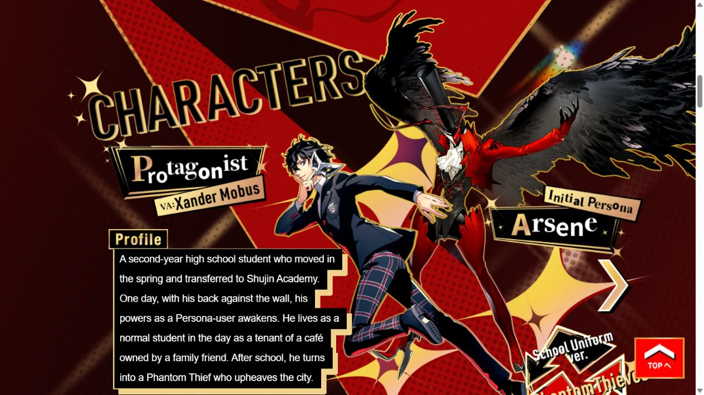

# Persona 5 Royal · 黑金角色拼贴

观察日期：**2026-10-07**。对象为[对应官方页面](https://persona.atlus.com/p5r/?lang=en#)的指定地区与版本，国别字段用于参考机构或创作者来源检索，不推断国家有固定风格。

## 参考与证据

- [ATLUS · Persona 5 Royal 官方英文页](https://persona.atlus.com/p5r/?lang=en#)（实例）：2026-10-07：黑金开场、PV/发行信息、红色网点角色舞台与双服装。
- [MoMA · Collage](https://www.moma.org/collection/terms/collage)（理论）：拼贴术语与作品资料帮助分析切片、群像、层叠；不是ATLUS作者意图声明。
- [W3C · Tabs Pattern](https://www.w3.org/WAI/ARIA/apg/patterns/tabs/)（规范）：内容切换的键盘与选择状态参考；本地采用button/aria-pressed，不宣称是完整APG Tabs实现。
- [官方公开交互脚本 · 2026-10-07](https://persona.atlus.com/p5r/resources/js/top.d7194e2d6bcaddee6e3c.js)（实例）：2026-10-07：非循环Slick默认500ms、角色切换及chara-box服装状态。金色闪光可见，完整Canvas登场轨迹未确认；本地7秒光点为近似。

[原站首屏](screenshots/persona-kinetic-source.jpg) · [本地桌面](../previews/persona-kinetic.jpg) · [本地手机](../previews/mobile/persona-kinetic.jpg)

[官方角色资料、Persona与校服切换区域原站证据](screenshots/persona-character-source.jpg)。

## 构成与设计分析

**可观察事实：**P5R 国际英文页以黑金群像、左侧PV入口和发行信息开场；红黑半调角色舞台把人物、Persona与黑金资料框分层组织。官方角色列表为十人，非循环 Slick 前后切换；服装控制改变当前 chara-box 的 on 状态。昼夜游戏截图以倾斜拼贴连接双重生活。

**本库分析：**群像建立作品的都市怪盗人格，独立角色与Persona让视觉差异对应真实角色身份；黑金到红金的转换区分开场与档案。拼贴理论可解释切片和层叠的构成关系，但不是ATLUS作者意图的声明。

| 维度 | 设计职责与约束 |
|---|---|
| 配色 | 黑金首屏表达 Royal；红黑网点、金框与大号切片标题表达都市怪盗风格。 |
| 字体 | 官方剪贴标题图 + 大号无衬线身份文字；中文正文水平 |
| 版式 | 中心大型群像+左右独立标题；全幅红色角色舞台；倾斜昼夜画面 |
| 素材 | 官方首屏群像、三位角色双服装、三张Persona立绘和真实游戏截图。 |
| 形状 | 斜切拼贴、金色边框、网点与剪贴字保持同一张海报的秩序。 |
| 层级 | Royal群像与发行信息 → 角色身份与形态 → 昼夜生活 → 官方平台入口。 |
| 动态 | 角色、Persona与资料整体500ms水平进退，三人子集首尾停止；服装即时更换。7秒金色光点为本地近似，可暂停；减少动态取消位移与光点。 |
| 整体关系 | 真实角色形态和Persona让视觉表达产品身份；金黑与红金按叙事阶段转换，水平正文约束强烈动势。 |

## 动态机制与本地映射

| 区域 | 原站依据 | 最终本地实现与差异 |
|---|---|---|
| 角色轨道 | Slick为非循环、无圆点、可swipe；默认500ms。官方首次Next到Kasumi。 | 三名角色为主人公、龙司、杏，各自真实Persona和两套服装。立绘、Persona与资料整体500ms水平进退，首尾停止；不包含Kasumi。 |
| 服装 | 当前角色 chara-box 状态切换，人物形态与相关层更新。 | 校服/怪盗服即时替换真实美术；未覆盖原站所有层变换。 |
| 首屏演出 | kv-canvas/bg-stars存在，金色闪光可见；完整Canvas角色登场轨迹未能确认。 | 首屏保留官方静态群像；金色光点7秒周期及轨迹为本地近似，可用AMBIENT暂停。没有运行PIXI或臆造人物登场轨迹。 |
| 音频 | 官网有英文有声PV入口，独立BGM未核验。 | 使用官方PV外链，用户主动观看；不添加音乐开关。 |

只实现三人子集，未复现十人全表、Kasumi、PIXI完整Canvas及全部服装层变换。减少动态取消水平位移和光点动画，保留角色/服装操作。正文与命中区保持水平，手机收敛海报偏移。

## 复用约束

- 真实 ATLUS/SEGA 美术仅用于用户授权私人研究。
- 只保留三名角色而非原站完整十人档案。
- 正文不随背景倾斜，选择状态明确且键盘可操作。
- 不自动轮播，不加入高频闪烁。
- 原站未核验独立 BGM，PV使用实际官网英文视频链接。

规范来源用于本地交互约束；除明确标注的第一方自述外，设计理念解释均为本库对选定样本的分析，不冒充品牌作者声明或整站合规结论。

## 复用入口

完整可复用描述见[Prompt](../prompts/persona-kinetic.md)，结构化信息见[案例条目](../entries/persona-kinetic.json)。[独立Demo](../demos/persona-kinetic/index.html)、[对应范围](../demos/persona-kinetic/fidelity.md)与[资产来源清单](../demos/persona-kinetic/assets-manifest.json)保留实现、媒体来源和限制；正文不重复一份完整Prompt。
