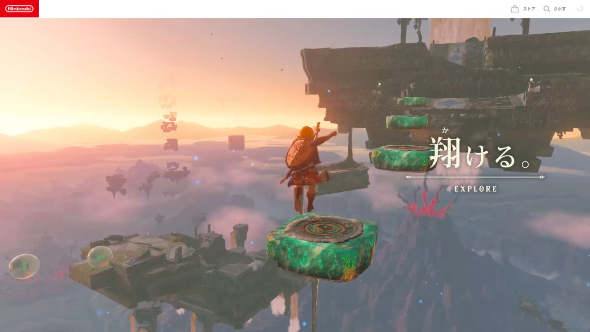

# 塞尔达 · 全景世界舞台

调研日期：2026-10-07。国家：日本。实际访问：https://www.nintendo.com/jp/zelda/totk/world/index.html。

## 来源与取证

- [Nintendo · Tears of the Kingdom WORLD](https://www.nintendo.com/jp/zelda/totk/world/index.html)（实例）：2026-10-07 web+浏览器核验 ON/OFF入口、全屏游戏视频、三个主题与底部世界目录。
- [W3C · Pause, Stop, Hide](https://www.w3.org/WAI/WCAG22/Understanding/pause-stop-hide.html)（规范）：核验持续自动动态的暂停要求；本地背景视频提供可持续暂停按钮，减少动态偏好下初始停止。

## 直接观察

浏览器先出现 ON/OFF 声音选择与古代绿环过渡，随后进入满幅游戏视频。页面可在翔ける、創る、紡ぐ之间切换；日文主题字位于画面右侧，Nintendo 顶条与世界目录较克制。原站视频为公开 HLS；bgm.mp3 为实际音频路径。

## 分析与推断

让真实游戏过程占满舞台，可以直接证明世界尺度与玩法自由；文字是解释方向而非替代证据。这是视觉分析，不是 Nintendo 官方设计意图陈述。

- 世界视频是信息主角，界面只提供章节方向和声音控制。
- 三个动作主题“翔ける／創る／紡ぐ”把世界与玩法相连。
- 文字和控制依附稳定位置，低密度让场景细节承担产品证明。

## 本地映射与约束

使用 Nintendo 世界页真实 HLS 场景片段、标题和缩略图；天空、创造、未知世界成为三段连续叙事。

- 官方资源只用于本库私人学习，原素材权利归 Nintendo。
- 本地是局部复现，三章自然文档滚动不同于原站舞台转场。
- 短片采用每章前6段，并未宣称复现完整视频。
- 字幕与控制保持高对比，不用持续动效阻碍阅读。
- 背景视频必须有持续暂停机制，音频默认关闭。

## 交互与可读性

- 底部缩略索引跳转三个实际世界章节，滚动更新当前章。
- 暂停按钮控制本地实际视频播放。
- 用户点击才播放原站 bgm.mp3，失败反馈，离开前台暂停。

W3C资料是实现约束的参考，并非声称当前官网已完全符合全部无障碍规范。局部复现的边界、音频与素材来源见 [fidelity](../demos/zelda-world/fidelity.md) 与 [assets-manifest](../demos/zelda-world/assets-manifest.json)。

## 可复用 Prompt

为【开放世界游戏】制作一个基于已核验官网的私人设计研究 demo。先记录官网实际 URL、调研日期、三个世界动作主题与声音入口，再下载有授权的官方场景、标题与字标到本地，逐项记录来源、尺寸、用途和处理方式。布局使用三段100svh场景舞台，每段真实视频覆盖全幅，标题在右侧，游戏Logo在左下，章节缩略目录稳定放置。信息顺序为世界场景、动作主题、章节导航、官方完整入口；避免用普通两栏功能卡替代视频叙事。使用古代青绿与象牙色细线控件，正文为可读取HTML。每章提供静态后备帧，视频可持续暂停，prefers-reduced-motion下初始停止；实际原站音乐仅在用户点击后播放，捕获play拒绝，页面离开前台暂停。手机收敛目录为三个等宽缩略项，正文与按钮保留可读尺寸。保留原生滚动，说明和原站转场、视频长度之间的差异。输出独立HTML/CSS/JS、assets-manifest.json、fidelity.md和真实浏览器预览。

避免：不要编造原站世界或曲名；不要以原创浮岛替代官方真实场景；不要自动播放声音；不要嵌入原站整页、追踪脚本或声称像素级完整复刻。

## 浏览器实测 · 2026-10-07

- 桌面设置 1440×1000、手机设置 390×844；正文/文档宽分别约 1424.8/1425 和 375.2/375 CSS px，无横向溢出。全部图像有 naturalWidth。
- 三个官方片段均 readyState=4，暂停按钮令全部视频暂停；第二章导航实际修改 URL hash 并滚动到创造章节。
- 用户点击 BGM 后 paused=false、error=null，浏览器读取时长 99.443281 秒；随后关闭。原站文件没有公开曲名。
- 桌面与手机首章真实截图：`../previews/zelda-world.jpg`、`../previews/zelda-world-mobile.jpg`。

截图由 CUA 在 Edge 浏览器保存。视口设置与浏览器实际截图像素不同：桌面 JPG 约 1425×990，手机 JPG 约 375×811；不放大或伪造分辨率。音频自动播放拒绝分支与 reduced-motion 降级均在代码中处理；本次未模拟浏览器拒绝或系统 reduced-motion 设置，不将它们记为已实测。

## 2026-10-07 动效补审更新

原站当前主脚本中桌面wheel翻章逻辑被注释；实测滚轮仅产生约3px位置变化。缩略点击改变active视频/标题；片尾推进下一章，指针停止3秒后界面隐去。本地已改同屏三章，停止非当前视频，提供键盘/水平触摸与暂停。300ms标题/亮度是本地近似；短片长度、片尾时机与原站完整HLS不同，未复制3秒自动隐藏、绿环加载和完整主菜单。

本轮记录优先于初版的静态/手动实现描述。原站触发、脚本证据、实际手机/键盘验证与诚实限制见 [十例动效审计](MOTION-AUDIT-GAMES-ART-JP.md#zelda-world)。
